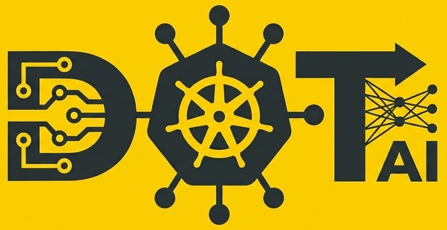

# DevOps AI Toolkit

    

**AI-powered platform engineering and DevOps automation through intelligent Kubernetes operations and conversational workflows.**

---

## [Read the Documentation](https://devopstoolkit.ai/docs/mcp/)

---

## Overview

DevOps AI Toolkit brings AI-powered intelligence to platform engineering, Kubernetes operations, and development workflows. Built on the Model Context Protocol (MCP), it integrates seamlessly with Claude Code, Cursor, and VS Code.

**Key capabilities:**
- Intelligent Kubernetes deployment recommendations
- AI-powered issue remediation and root cause analysis
- Organizational pattern and policy management
- Automated repository setup with governance files
- Shared prompt libraries for consistent workflows

[Read the Documentation](https://devopstoolkit.ai/docs/mcp/)

## Support

- **[Support Guide](SUPPORT.md)** - How to get help and where to ask questions
- **GitHub Issues**: [Bug reports and feature requests](https://github.com/vfarcic/dot-ai/issues)
- **GitHub Discussions**: [Community Q&A and discussions](https://github.com/vfarcic/dot-ai/discussions)

## Contributing & Governance

We welcome contributions from the community! Please review:

- **[Contributing Guidelines](CONTRIBUTING.md)** - How to contribute code, docs, and ideas
- **[Code of Conduct](CODE_OF_CONDUCT.md)** - Community standards and expectations
- **[Security Policy](SECURITY.md)** - How to report security vulnerabilities
- **[Governance](docs/GOVERNANCE.md)** - Project governance and decision-making
- **[Maintainers](docs/MAINTAINERS.md)** - Current project maintainers
- **[Roadmap](docs/ROADMAP.md)** - Project direction and priorities

## Help Us Improve

Your feedback shapes dot-ai's future! After using the tools, you may occasionally see a feedback prompt - we'd love to hear what's working and what could be better.

[Share your feedback](https://forms.gle/dJcDXtsxhCCwgxtT6)

## License

MIT License - see [LICENSE](LICENSE) file for details.

## Acknowledgments

DevOps AI Toolkit is built on:
- [Model Context Protocol](https://modelcontextprotocol.io/) for AI integration framework
- [Vercel AI SDK](https://sdk.vercel.ai/) for unified AI provider interface
- [Kubernetes](https://kubernetes.io/) for the cloud native foundation
- [CNCF](https://www.cncf.io/) for the cloud native ecosystem

---

**DevOps AI Toolkit** - Making cloud native operations accessible through AI-powered intelligence.
