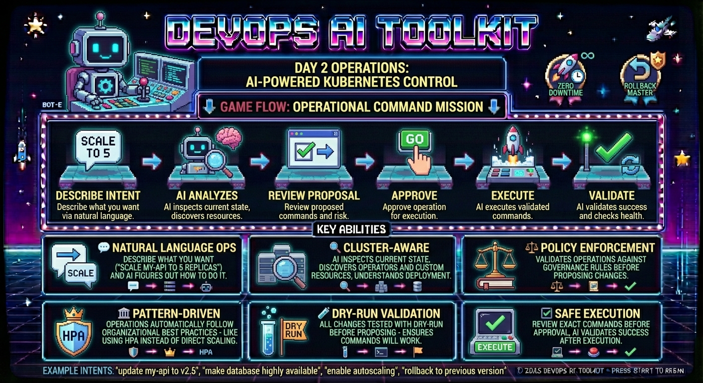

# Operate Guide

**Complete guide for AI-powered Kubernetes operations with the DevOps AI Toolkit.**



## Using via Web UI

These tools are also available through the [Web Dashboard](https://devopstoolkit.ai/docs/ui).

## Prerequisites

Before using this guide, complete the [Deployment Guide](../setup/deployment.md) to set up:
- DevOps AI Toolkit deployed
- AI model API key configured (see [AI Model Configuration](../setup/deployment.md#ai-model-configuration) for supported models and setup)
- `KUBECONFIG` pointing to your Kubernetes cluster

**Required - Capability Management:**
- Vector DB service (Qdrant) for capability storage
- Cluster capabilities discovered via [Capability Management Guide](capability-management.md)
- **Note**: Operations will fail without capabilities - the system requires semantic understanding of your cluster resources

**Optional - Enhanced with Organizational Context:**
- Organizational patterns created via [Pattern Management Guide](../organizational-data/patterns.md)
- Policy intents created via [Policy Management Guide](../organizational-data/policies.md)
- When configured, operations automatically follow organizational best practices and governance rules

## Overview

**What it does**: Provides AI-powered Day 2 operations for any Kubernetes resources through natural language intents. Updates, scales, enhances, and manages workloads, databases, infrastructure, and cloud resources with cluster-aware recommendations and organizational governance.

**Use when**: You need to perform operational changes on deployed resources - applications, databases, storage, AWS/Azure/GCP resources via operators, networking, or any Kubernetes-managed infrastructure.

📖 **Full Guide**: This document covers the complete operations workflow with detailed examples and behind-the-scenes explanations.

### Key Features

The DevOps AI Toolkit operate feature provides:
- **Natural language operations** - Describe what you want, AI figures out how to do it
- **Cluster-aware decisions** - Leverages installed operators and custom resources automatically
- **Pattern-driven operations** - Applies organizational best practices to every change
- **Policy enforcement** - Validates operations against governance rules before execution
- **Dry-run validation** - All changes tested before proposing to ensure they'll work
- **Safe execution** - Exact approved commands executed with comprehensive validation
- **Iterative validation** - Verifies operations completed successfully with AI analysis

### How AI-Driven Operations Work

**Traditional Problem**: Manual operations require deep Kubernetes expertise, error-prone YAML editing, and knowing which operators/resources are available.

**AI Operations Solution**: Natural language intents analyzed by AI with full cluster awareness and organizational context.

**Operations Flow**:
1. **Intent Analysis**: AI understands your operational goal
2. **Cluster Investigation**: AI inspects current state and discovers relevant resources
3. **Context Integration**: Applies relevant organizational patterns, policies, and cluster capabilities
4. **Solution Design**: Generates operational plan that satisfies your intent
5. **Dry-Run Validation**: Tests all changes to ensure they'll succeed
6. **User Approval**: Review proposed changes with full transparency
7. **Execution**: Approved commands executed exactly as shown
8. **Validation**: AI verifies operation completed successfully

## Complete Workflow Example

<!--
Test Scenario Setup for Pattern-Driven Scaling with HPA Creation:
Create a deployment with resource requests/limits to demonstrate pattern-driven operations

kubectl create namespace operate-demo
kubectl apply -n operate-demo -f - <<'EOF'
apiVersion: apps/v1
kind: Deployment
metadata:
  name: demo-api
spec:
  replicas: 2
  selector:
    matchLabels:
      app: demo-api
  strategy:
    type: RollingUpdate
    rollingUpdate:
      maxUnavailable: 25%
      maxSurge: 25%
  template:
    metadata:
      labels:
        app: demo-api
    spec:
      containers:
      - name: nginx
        image: nginx:1.21
        resources:
          requests:
            cpu: 100m
            memory: 128Mi
          limits:
            cpu: 200m
            memory: 256Mi
        ports:
        - containerPort: 80
EOF

This creates a deployment where:
- 2 replicas running nginx:1.21
- Resource requests/limits configured (required for HPA)
- RollingUpdate strategy with 25% max unavailable/surge
- Ready for scaling operations demonstration
- Uses separate namespace to keep demo isolated
-->

### Pattern-Driven Scaling with HPA Creation

This example demonstrates how organizational patterns influence operational decisions. We'll scale a deployment twice:
1. **Without pattern** - AI recommends direct replica scaling
2. **With pattern** - Same intent, but AI creates HPA instead

**Scenario Setup:**
```bash
# Deployment exists: demo-api in operate-demo namespace
# Current state: 2 replicas, nginx:1.21, with resource requests/limits
```

#### Step 1: Baseline Operation (No Pattern)

First, let's see what AI recommends without any organizational patterns:

```md
User: scale demo-api deployment in operate-demo namespace to 4 replicas
```

~~~md
Agent: Let me analyze the current state and propose a scaling operation.

[Uses mcp__dot-ai__operate with intent "scale demo-api deployment in operate-demo namespace to 4 replicas"]

**Analysis Complete:**

Scaling demo-api deployment from 2 to 4 replicas in the operate-demo namespace. This is a simple, low-risk scaling operation that will increase application availability and capacity.

**Current State:**
- Deployment: demo-api (operate-demo namespace)
- Current replicas: 2/2 running
- Image: nginx:1.21
- Strategy: RollingUpdate (25% max unavailable/surge)
- Resources: 100m CPU/128Mi memory requests, 200m CPU/256Mi memory limits

**Proposed Changes:**
- **Update Deployment** demo-api: replicas: 4 (increased from 2)
- Rationale: Directly satisfies the operational intent to scale deployment to 4 replicas

**Commands to Execute:**
```bash
kubectl scale deployment demo-api --replicas=4 -n operate-demo
```

**✅ Dry-Run Validation:** Success - Deployment accepts the replica count modification

**Patterns Applied:** None

**Capabilities Used:** Deployment

**Policies Checked:**
- Applications must NEVER use 'latest' tag - PASSED (uses nginx:1.21)

**Risk Assessment:** LOW RISK
- Scaling operation is non-disruptive
- New pods created in parallel with existing configuration
- No downtime expected, easily reversible

**Session ID:** opr-1763169767759-0c2a4bb7

📊 **Visualization:** http://localhost:3000/v/opr-1763169767759-0c2a4bb7

Would you like to execute this operation?
~~~

#### Visualization (Optional)

The visualization URL opens an interactive analysis view in the Web UI:


> **Note**: Visualization URLs require additional setup:
> - Configure `webUI.baseUrl` in your Helm values (see [Deployment Guide - Web UI Visualization](../setup/deployment.md#web-ui-visualization))
> - Install the Web UI (see [Web UI Documentation](https://devopstoolkit.ai/docs/ui))

**What happened behind the scenes:**
- AI analyzed deployment and discovered current state: 2 replicas, properly configured resources
- No organizational patterns found related to "scaling"
- Generated simple `kubectl scale` command - direct approach
- Validated with dry-run successfully
- Proposed straightforward replica increase

**Note:** Without patterns, AI takes the most direct approach - modifying replicas directly. This works, but doesn't capture organizational best practices like using HPA for managed scaling.

---

#### Step 2: Create Organizational Pattern

Now let's create a pattern to enforce organizational best practice - using HPA for scaling operations:

```md
User: I want to create a pattern for horizontal scaling using HPA
```

```md
Agent: I'll help you create an organizational pattern. Let me start the workflow.

[Uses mcp__dot-ai__manageOrgData with dataType: "pattern", operation: "create"]

**Pattern Creation Workflow** (7 steps):

1. **Description:** "Horizontal scaling with HPA"
2. **Initial triggers:** "applications, scaling, replicas, horizontal"
3. **Expanded triggers:** "HorizontalPodAutoscaler, scaling, horizontal scaling"
4. **Suggested resources:** "HorizontalPodAutoscaler"
5. **Rationale:** "All scaling operations should use HorizontalPodAutoscaler for managing multiple replicas, even if both min and max are the same."
6. **Created by:** "documentation-team"
7. **Review & confirm:** ✅

**Pattern Created Successfully!**
- Pattern ID: 179c61a6-3662-44ba-879f-dfb0fb15d4d2
- Stored in vector database
- Ready to enhance AI recommendations
```

**What happened behind the scenes:**
- Pattern workflow gathered all necessary metadata
- Pattern stored in Qdrant vector database with semantic embeddings
- AI can now find this pattern via semantic search when users request scaling operations
- Pattern will influence operational recommendations automatically

---

#### Step 3: Pattern-Influenced Operation

Now let's run the **exact same scaling intent** and see how the pattern changes the recommendation:

```md
User: scale demo-api deployment in operate-demo namespace to 4 replicas. Start the process again.
```

~~~md
Agent: Let me analyze the operation with organizational patterns applied.

[Uses mcp__dot-ai__operate with intent "scale demo-api deployment in operate-demo namespace to 4 replicas"]

**Analysis Complete:**

Scaling demo-api deployment from 2 to 4 replicas using HorizontalPodAutoscaler as per organizational Pattern 1 (Horizontal scaling with HPA). The pattern specifies that all scaling operations should use HPA for managing multiple replicas, even when both min and max are set to the same value.

**Current State:**
- Deployment: demo-api (operate-demo namespace)
- Current replicas: 2 running
- Image: nginx:1.21
- Resource requests: 100m CPU / 128Mi memory (HPA-ready)
- No HPA configured

**Proposed Changes:**
- **Create HorizontalPodAutoscaler** demo-api
  - minReplicas: 4, maxReplicas: 4
  - CPU utilization target: 80%
  - Rationale: Follows organizational Pattern 1 which requires all scaling operations to use HPA for consistency and operational best practices. Creates foundation for future autoscaling enhancements.

**HPA Manifest:**
```yaml
apiVersion: autoscaling/v2
kind: HorizontalPodAutoscaler
metadata:
  name: demo-api
  namespace: operate-demo
spec:
  scaleTargetRef:
    apiVersion: apps/v1
    kind: Deployment
    name: demo-api
  minReplicas: 4
  maxReplicas: 4
  metrics:
  - type: Resource
    resource:
      name: cpu
      target:
        type: Utilization
        averageUtilization: 80
```

**✅ Dry-Run Validation:** Success - Cluster accepted the HPA resource definition

**Patterns Applied:**
- Pattern 1: Horizontal scaling with HPA - All scaling operations use HorizontalPodAutoscaler for consistency and operational governance

**Capabilities Used:** HorizontalPodAutoscaler (autoscaling/v2)

**Risk Assessment:** LOW RISK
- Scaling up from 2 to 4 replicas on healthy deployment
- Existing pods continue running while new replicas created
- Easily reversible by deleting HPA or adjusting counts

**Session ID:** opr-1763170292295-0dbae152

Would you like to execute this operation?
~~~

**What happened behind the scenes:**
- Vector search found relevant pattern: "Horizontal scaling with HPA" (semantic match on "scaling", "replicas")
- AI read pattern rationale: "All scaling operations should use HorizontalPodAutoscaler..."
- AI changed strategy from direct replica scaling to HPA creation
- Generated HPA manifest with minReplicas=maxReplicas=4 to lock at desired count
- Validated HPA manifest with dry-run successfully
- Listed pattern in "patternsApplied" field for audit trail

**Key Difference:** Same intent, completely different approach! Pattern transformed a simple `kubectl scale` into an HPA resource, enforcing organizational best practice.

---

#### Step 4: Execute and Validate

Let's approve the operation and watch it execute:

```md
User: Yes, execute the operation
```

~~~md
Agent: Executing approved operation and validating results.

[Uses mcp__dot-ai__operate with sessionId: "opr-1763170292295-0dbae152", executeChoice: 1]

**Execution Results:**

✅ **Command 1:** HPA creation
```bash
kubectl apply -f - <<'EOF'
apiVersion: autoscaling/v2
kind: HorizontalPodAutoscaler
...
EOF
```
**Output:** `horizontalpodautoscaler.autoscaling/demo-api created`
**Status:** Success

**AI Validation (Confidence: 98%):**

HPA successfully created and reconciled. The controller scaled the deployment from 2 to 4 replicas as specified by MinReplicas=4/MaxReplicas=4 configuration.

**Verification Results:**
- ✅ 4 pods running in operate-demo namespace
- ✅ All pods in Running state
- ✅ HPA status: 4 current / 4 desired replicas
- ✅ Deployment scaled successfully from 2 to 4 replicas

**Operation completed successfully!**
~~~

**What happened behind the scenes:**
- Server executed the approved command exactly as shown
- HPA resource created in cluster
- HPA controller detected new HPA and reconciled deployment
- Deployment scaled from 2 to 4 replicas automatically
- AI used remediate tool internally to validate success
- AI confirmed all 4 pods running and HPA operational
- Complete audit trail maintained in session

---

## Summary

This example demonstrated:

1. **Baseline behavior** - Without patterns, AI recommends direct approach (kubectl scale)
2. **Pattern creation** - Define organizational best practice (use HPA for scaling)
3. **Pattern influence** - Same intent produces different recommendation (HPA creation)
4. **Safe execution** - Exact approved commands executed with AI validation

**Key Takeaway:** Organizational patterns transform operations from "what works" to "what's best for your organization" - automatically enforcing governance without manual intervention.

**Learn More:**
- See [Pattern Management Guide](../organizational-data/patterns.md) for detailed information on creating and managing organizational patterns
- Explore [Policy Management Guide](../organizational-data/policies.md) for governance and compliance enforcement

---

## Operational Flexibility

The operate tool is **fully general-purpose** - it handles any Kubernetes operational change through natural language intents:

```md
# The tool figures out how to accomplish your goal
operate(intent="update my-api to version v2.5.0")
operate(intent="make my-database highly available with backups")
operate(intent="enable autoscaling for my-api based on CPU")
operate(intent="rollback my-api to previous version")
operate(intent="add Prometheus monitoring to my-api")
```

**How it works:** AI analyzes your intent, inspects cluster state, applies organizational patterns/policies, generates appropriate Kubernetes resources (create/update/delete), validates with dry-run, and proposes exact commands for your approval.

---

## Best Practices

### Writing Effective Intents

**Be specific about target resources:**
```md
✅ Good: "scale demo-api deployment in production namespace to 5 replicas"
❌ Vague: "scale the app"
```

**Include namespace when working with multiple environments:**
```md
✅ Good: "update my-api in staging namespace to v2.0"
❌ Ambiguous: "update my-api to v2.0" (which namespace?)
```

**Specify operational requirements when relevant:**
```md
✅ Good: "update my-api to v2.0 with zero downtime"
✅ Good: "make my-database highly available with backups"
```

### Session Management

- **Review proposals carefully** - Always review proposed changes before execution
- **Sessions are temporary** - Session data expires after operation completion
- **Refine if needed** - Use `refinedIntent` parameter to clarify ambiguous requests

### Pattern and Policy Integration

- **Create patterns proactively** - Define operational best practices before they're needed
- **Use specific triggers** - Patterns with clear triggers match more accurately
- **Document rationale** - Clear rationale helps AI apply patterns correctly
- **Test patterns** - Verify patterns influence recommendations as expected

---

## Troubleshooting

### Operation Fails with "No capabilities found"

**Problem:** Operate tool requires cluster capabilities for semantic resource matching.

**Solution:** Use the controller for automatic capability scanning (recommended), or scan manually if the controller cannot reach the server:
```md
# Manual scan (only if controller not available)
User: Scan my cluster capabilities

[Uses mcp__dot-ai__manageOrgData with dataType: "capabilities", operation: "scan"]
```

See [Capability Management Guide](capability-management.md) for controller setup and manual scanning options.

### Pattern Not Applied to Operation

**Problem:** Created a pattern but operate tool doesn't use it.

**Possible causes:**
1. **Trigger mismatch** - Pattern triggers don't match your operational intent keywords
2. **Vector search ranking** - Other patterns ranked higher for your intent
3. **Pattern not stored** - Pattern creation didn't complete successfully

**Solution:**
- Review pattern triggers and ensure they match your intent keywords
- Check pattern was stored: `manageOrgData({ dataType: "pattern", operation: "list" })`
- Try more specific intent wording that matches pattern triggers

### Dry-Run Validation Fails

**Problem:** AI reports dry-run validation failures.

**This is expected behavior** - AI iterates to fix validation errors:
- AI generates manifest
- Dry-run validates and reports errors
- AI fixes errors based on feedback
- Retries validation (up to 30 iterations)

If validation still fails after iterations, AI will report the specific issue for manual review.

---

## Related Guides

- **[Recommendation Guide](recommend.md)** - Initial application deployment with capability-enhanced recommendations
- **[Remediate Guide](remediate.md)** - AI-powered troubleshooting and issue resolution
- **[Pattern Management Guide](../organizational-data/patterns.md)** - Creating and managing organizational patterns
- **[Policy Management Guide](../organizational-data/policies.md)** - Defining and enforcing governance policies
- **[Capability Management Guide](capability-management.md)** - Cluster resource discovery and semantic capabilities
