# Why DevOps AI Toolkit?

**Understanding the unique value of specialized DevOps intelligence over general-purpose AI assistants.**

---

## The Question

With powerful AI assistants like Claude Code available, why use a specialized DevOps toolkit? Can't you just use Claude Code with kubectl and API calls?

**Short answer**: You can - for simple tasks. But for production-grade DevOps operations, you need **organizational context**, **autonomous operations**, and **specialized intelligence** that general-purpose AI cannot provide.

---

## Architecture Comparison

### General-Purpose AI + Manual API Calls

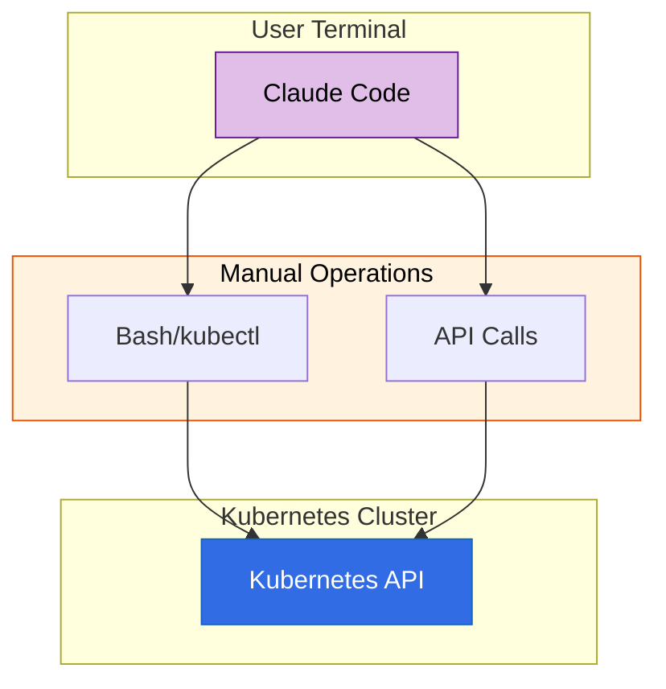

**Characteristics:**
- Generic AI with no DevOps-specific training
- Manual kubectl commands and API calls
- No persistent state between sessions
- No organizational context
- Human must be present for all operations

### DevOps AI Toolkit Ecosystem

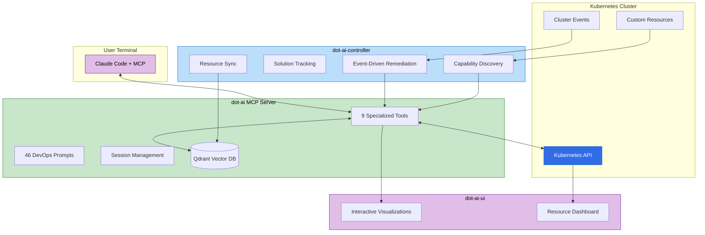

**Characteristics:**
- Specialized DevOps intelligence
- Persistent organizational knowledge
- Autonomous operations (controller)
- Rich visualizations
- Multi-step workflow support

---

## Key Differentiators

### 1. Organizational Context & Knowledge Management

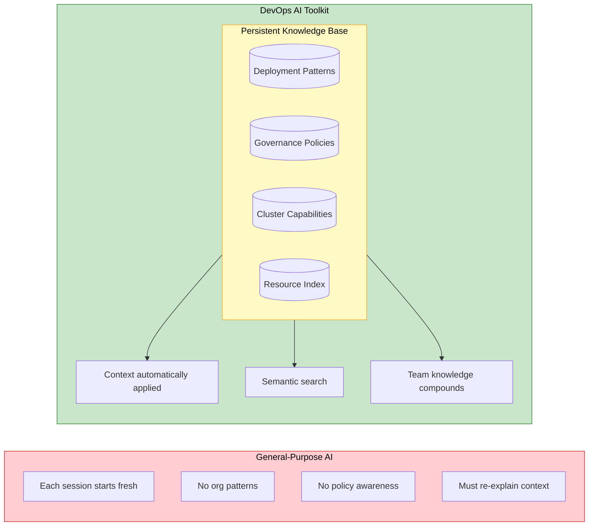

| Capability | General-Purpose AI | DevOps AI Toolkit |
|------------|-------------------|-------------------|
| Deployment patterns | None - starts fresh | Vector DB stores org patterns |
| Policy enforcement | Manual checks | Automatic policy matching |
| Resource capabilities | Must discover each time | Indexed with semantic search |
| Historical context | Conversation only | Persistent across sessions |
| Team knowledge | Not captured | Stores rationale & best practices |

**Example**: When you ask to "deploy a database", the toolkit automatically:
1. Searches your organization's database deployment patterns
2. Applies relevant governance policies
3. Matches against discovered cluster capabilities
4. Recommends solutions that fit your organization's standards

### 2. Autonomous Operations

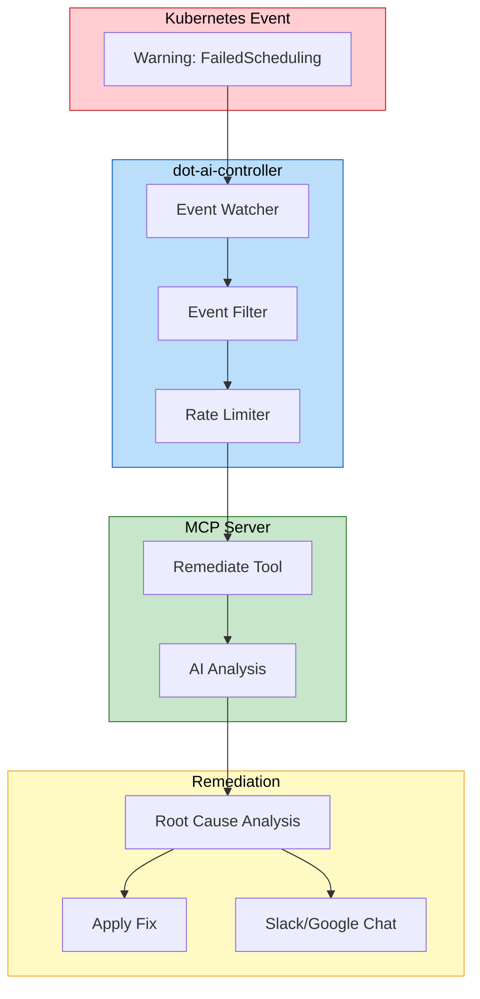

**This is impossible with general-purpose AI.** Claude Code only operates when you're actively using it.

The dot-ai-controller provides 24/7 autonomous capabilities:

| CRD | Function |
|-----|----------|
| **RemediationPolicy** | Watches events, triggers AI analysis, auto-fixes issues |
| **Solution** | Tracks deployed resources, manages lifecycle |
| **ResourceSyncConfig** | Keeps vector DB synchronized with cluster state |
| **CapabilityScanConfig** | Auto-discovers new CRDs and operators |

### 3. Multi-Step Workflow Support

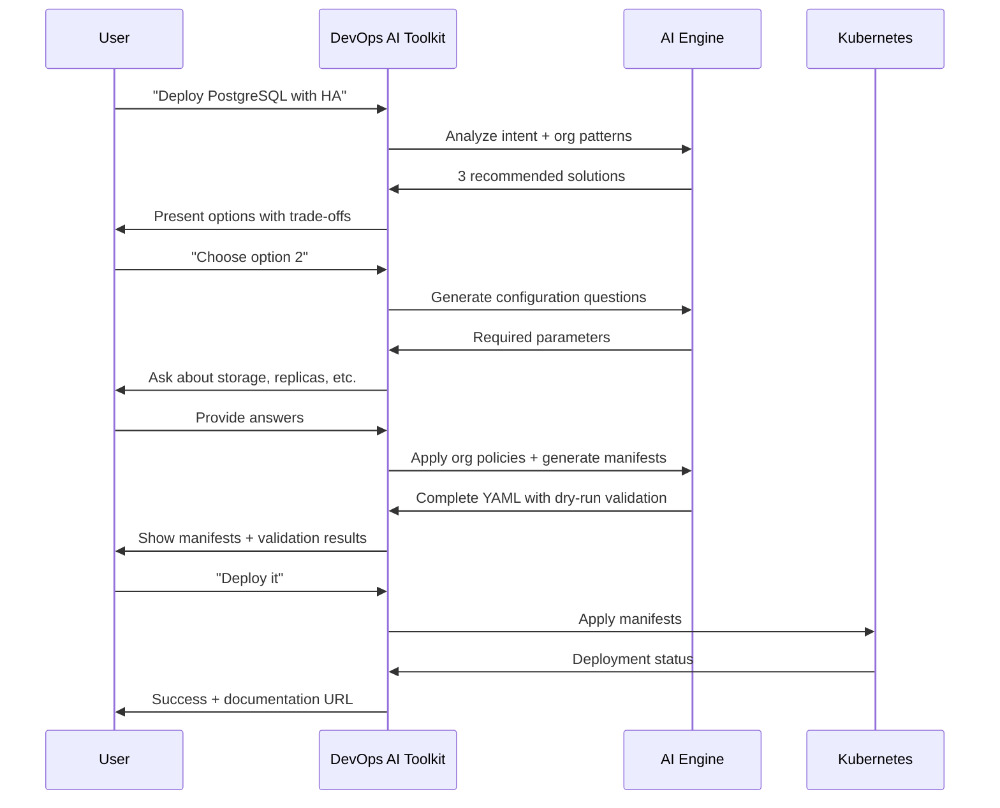

**General-purpose AI workflow:**
```
User: "Deploy postgres with HA"
AI: *suggests kubectl commands*
User: *runs commands, gets errors*
AI: *debugs errors*
User: *runs more commands*
... (manual orchestration continues)
```

**DevOps AI Toolkit workflow:**
```
recommend → chooseSolution → answerQuestion → generateManifests → deployManifests
```

Each step maintains session state, applies organizational context, and validates before proceeding.

### 4. Security Through Controlled Tool Access

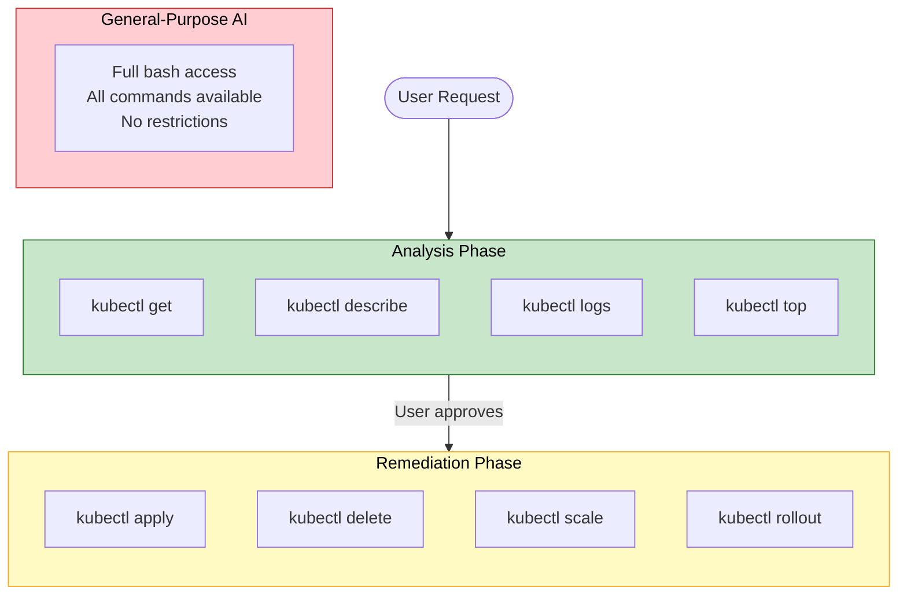

**This is a critical security differentiator.** General-purpose AI assistants have unrestricted access to all bash commands. The DevOps AI Toolkit implements **phase-based tool restrictions**:

| Workflow Phase | Available Tools | Why |
|----------------|-----------------|-----|
| **Analysis** | Read-only: `kubectl get`, `describe`, `logs`, `top` | Safe exploration without risk |
| **User Decision** | None - waiting for approval | Human-in-the-loop checkpoint |
| **Remediation** | Write: `kubectl apply`, `delete`, `scale`, `rollout` | Only after explicit approval |

**How it works:**

1. **During analysis**, AI can only use read-only kubectl tools - it cannot modify cluster state even if it wanted to
2. **User reviews** the analysis and proposed remediation
3. **Only after approval** are write tools attached to the AI context
4. **Each workflow step** has a specific, limited tool set

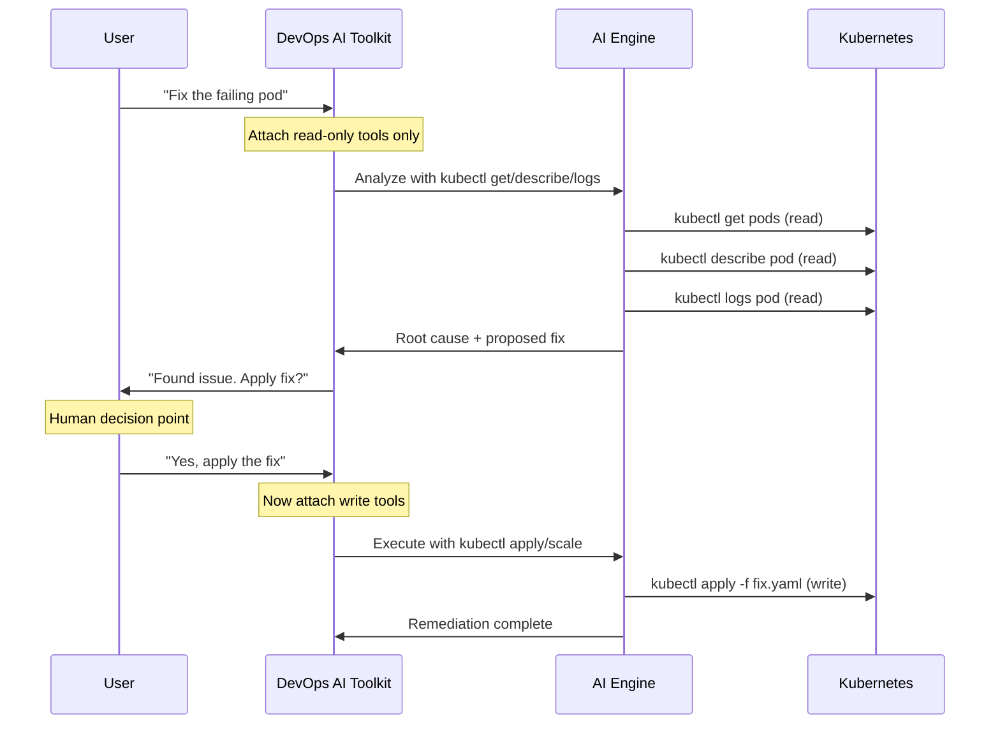

**Benefits:**

- **Blast radius limitation** - AI mistakes during analysis cannot modify cluster state
- **Audit trail** - Clear separation between what AI observed vs what it changed
- **Compliance** - Meets security requirements for human approval before changes
- **Confidence** - Users can let AI investigate freely knowing it cannot break anything

**Comparison:**

| Aspect | General-Purpose AI | DevOps AI Toolkit |
|--------|-------------------|-------------------|
| Tool access | All bash commands always | Phase-restricted tool sets |
| Analysis safety | Could accidentally modify | Read-only tools only |
| Change approval | Implicit (runs what you ask) | Explicit human checkpoint |
| Blast radius | Unlimited | Limited by workflow phase |

### 5. Reliability Through Deterministic Operations

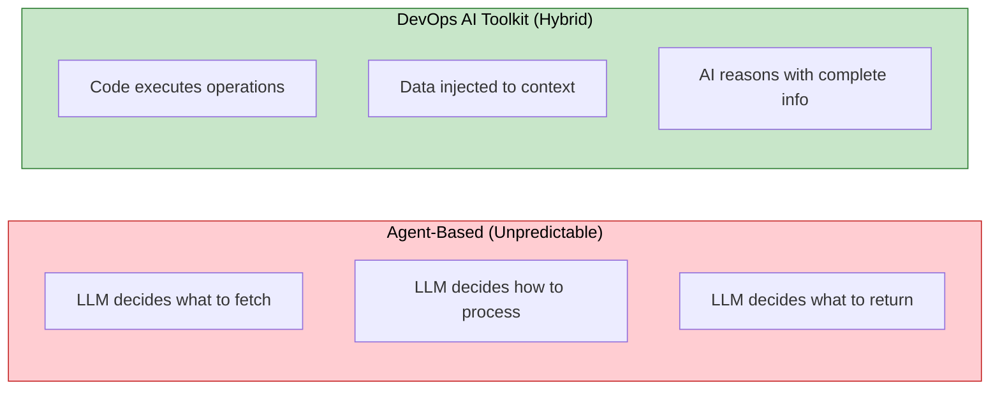

**The toolkit uses a hybrid architecture** that combines deterministic code execution with AI reasoning - not pure agent-based operations where AI decides everything.

#### Code-Based Operations vs Agent Operations

| Approach | General-Purpose AI | DevOps AI Toolkit |
|----------|-------------------|-------------------|
| Data collection | AI decides what to fetch | Code fetches required data |
| Processing | AI interprets raw output | Code parses and structures |
| Consistency | Varies by conversation | Deterministic execution |
| Reliability | Depends on AI's choices | Guaranteed operations |

**Example - Capability Discovery:**

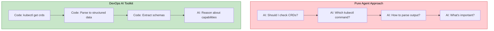

- **Pure agent**: AI might forget to check CRDs, use wrong commands, or miss important fields
- **Toolkit**: Code reliably collects all CRDs, parses them correctly, then AI reasons about the structured result

#### Context Injection vs Tool-Based Retrieval

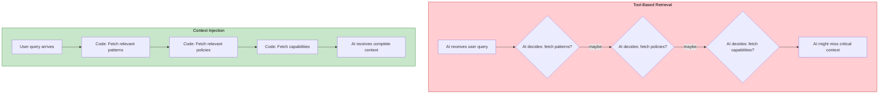

| Aspect | Tool-Based Retrieval | Context Injection |
|--------|---------------------|-------------------|
| Data availability | AI might not call the tool | Always present in context |
| Consistency | Varies by AI's judgment | Guaranteed inclusion |
| Org patterns | AI might forget to check | Always included for recommendations |
| Policies | AI might skip policy lookup | Always enforced |
| Capabilities | AI might miss some | Complete set provided |

**Why this matters:**

When a user asks "deploy a database", the toolkit:
1. **Code** fetches matching patterns from vector DB (not left to AI's discretion)
2. **Code** fetches applicable policies (guaranteed, not optional)
3. **Code** fetches cluster capabilities (complete, not partial)
4. **AI** receives all context and reasons about the best solution

A pure agent approach might:
- Forget to check organizational patterns
- Skip policy validation
- Miss available operators
- Give inconsistent recommendations

**The result**: Predictable, policy-compliant recommendations every time - not just when the AI "remembers" to check.

### 6. Specialized DevOps Intelligence

| Capability | General-Purpose AI | DevOps AI Toolkit |
|------------|-------------------|-------------------|
| Kubernetes expertise | Generic knowledge | 46 specialized prompts |
| Deployment recommendations | Manual research | AI recommends based on capabilities |
| Operator awareness | Must discover manually | Auto-detects Crossplane, CAPI, Kyverno, KEDA |
| Helm chart selection | Manual ArtifactHub search | AI-powered chart selection |
| Remediation guidance | Generic troubleshooting | Structured analysis with confidence scores |

**The 9 specialized MCP tools:**

| Tool | Purpose |
|------|---------|
| `recommend` | AI-powered deployment recommendations |
| `query` | Natural language cluster exploration |
| `remediate` | Root cause analysis and remediation |
| `operate` | Day 2 operations (scale, update, rollback) |
| `manageOrgData` | Pattern, policy, and capability management |
| `projectSetup` | Repository governance automation |
| `chooseSolution` | Solution selection with configuration |
| `answerQuestion` | Multi-step Q&A workflow |
| `version` | System health and diagnostics |

### 7. Full Operational Dashboard (Not Just Visualizations)

The toolkit is evolving from returning visualization URLs to providing a **complete Kubernetes operational dashboard** with AI deeply integrated.

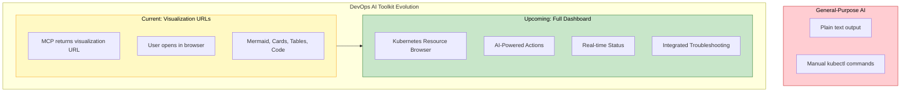

#### Current: AI-Generated Visualizations

MCP tools return visualization URLs for complex output:
- **Mermaid diagrams** - topology, workflows, dependencies
- **Card grids** - solution comparison with status indicators
- **Syntax-highlighted code** - YAML manifests with copy
- **Data tables** - resources with AI-driven status coloring
- **Bar charts** - resource metrics visualization

#### Upcoming: Full Kubernetes Dashboard

The dashboard transforms from visualization-only to a **complete operational interface**:

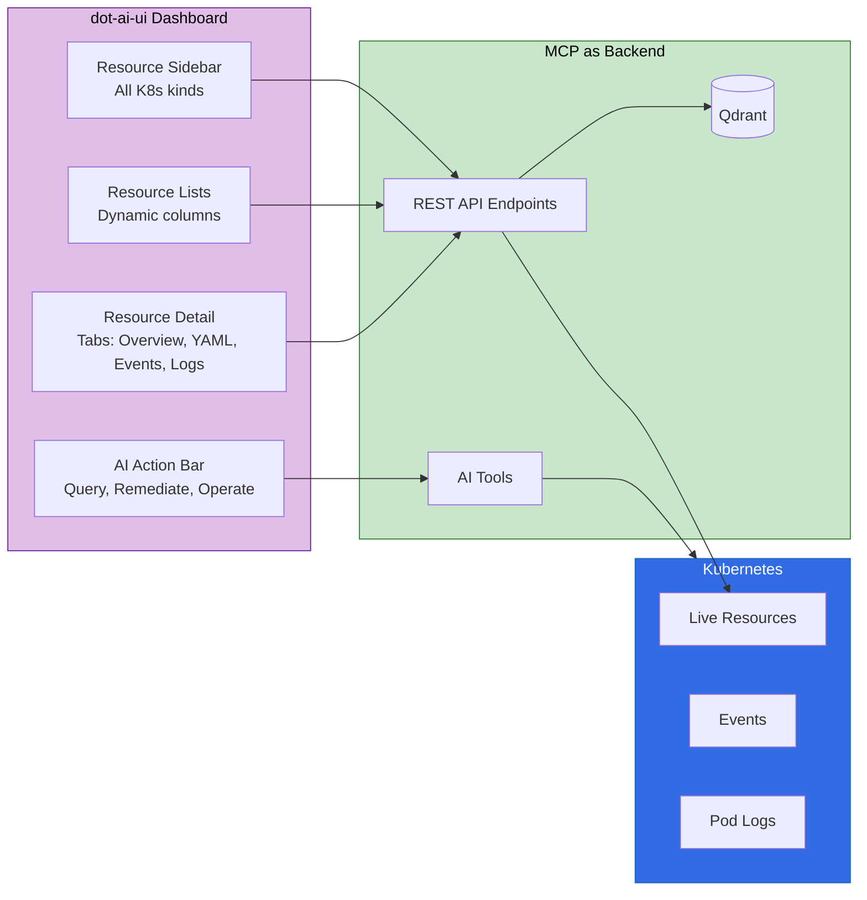

**Dashboard Features:**

| Feature | Description |
|---------|-------------|
| **Resource Browser** | Sidebar showing all resource kinds (Pods, Deployments, CRDs) with counts |
| **Dynamic Tables** | Columns auto-generated from Kubernetes printer columns |
| **Resource Detail** | Tabbed view: Overview, Metadata, Spec, Status, YAML, Events, Logs |
| **Namespace Filtering** | Quick namespace selector for scoping views |
| **Multi-Select** | Select multiple resources for batch AI analysis |
| **AI Action Bar** | Context-aware buttons: Query, Remediate, Operate, Recommend |
| **Status Coloring** | AI-driven problem indication (red/yellow/green) |
| **Pod Logs** | Container logs with multi-container support |
| **Events Timeline** | Kubernetes events for any resource |

**MCP as Backend:**

The MCP server provides REST APIs that power the dashboard:

```
GET /api/v1/resources/kinds    → Sidebar navigation
GET /api/v1/resources          → Resource tables with live status
GET /api/v1/resource           → Single resource detail (full spec/status)
GET /api/v1/events             → Kubernetes events for a resource
GET /api/v1/logs               → Pod container logs
GET /api/v1/namespaces         → Namespace dropdown
POST /api/v1/tools/query       → AI-powered cluster analysis
POST /api/v1/tools/remediate   → AI-powered troubleshooting
```

**AI Integration in Dashboard:**

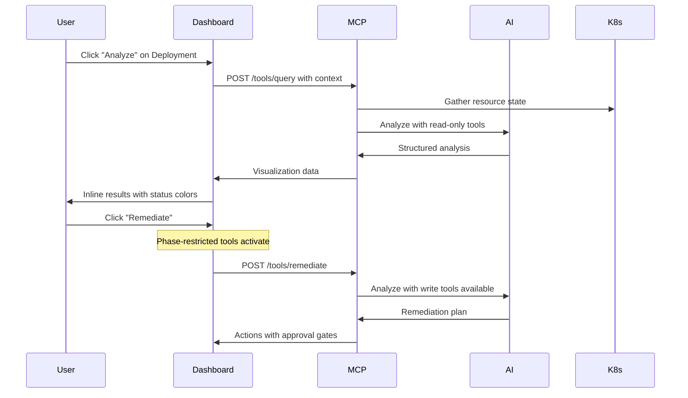

**Key Differentiator:** The dashboard isn't just a visualization layer - it's an **AI-native operations interface** where:
- Resource context flows automatically to AI tools
- AI results render inline with status-based styling
- Tool restrictions (read-only vs write) are enforced
- Human approval gates are built into the workflow

### 8. Semantic Search & Natural Language Queries

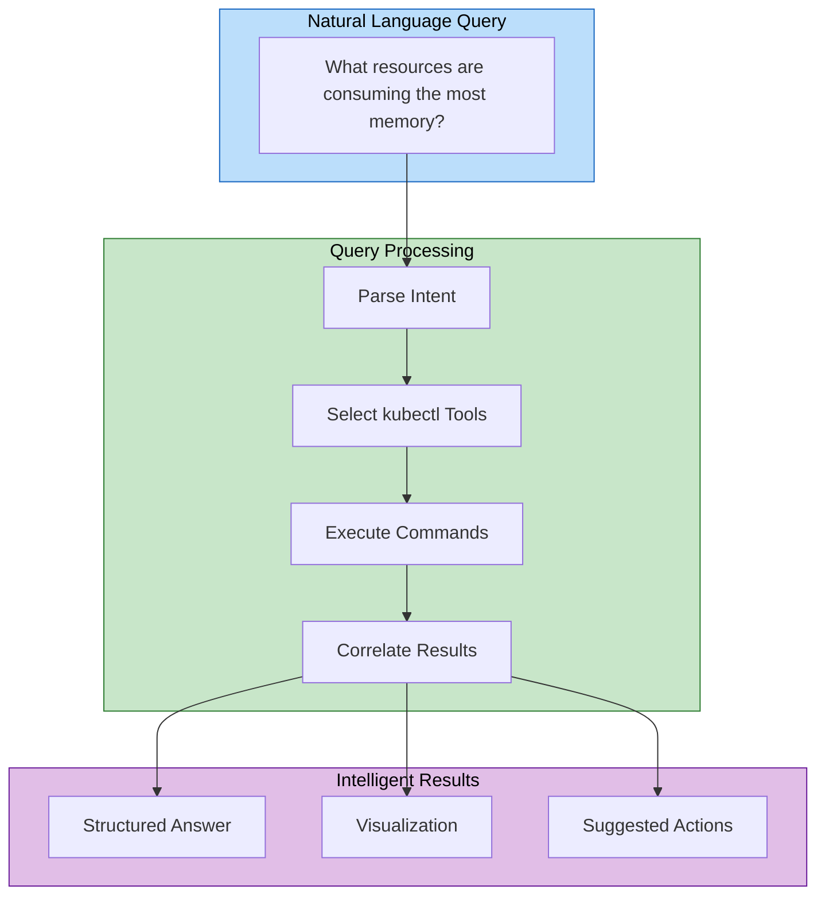

Instead of:
```bash
kubectl top pods --all-namespaces | sort -k4 -rn | head -10
kubectl get hpa --all-namespaces
kubectl describe node | grep -A5 "Allocated resources"
```

Just ask:
```
"What resources in production are consuming the most memory?"
```

The AI uses multiple kubectl tools, correlates the data, and provides a comprehensive answer with visualization.

---

## When to Use Each Approach

### Use General-Purpose AI When:
- Simple, one-off kubectl operations
- Ad-hoc troubleshooting that doesn't need automation
- Quick prototyping before formalizing patterns
- Environments without MCP support

### Use DevOps AI Toolkit When:
- You want to codify deployment patterns
- Teams need consistent policy enforcement
- Autonomous remediation is desired (24/7 operations)
- Rich visualizations improve understanding
- Semantic search over resources is valuable
- Multi-step deployment workflows are common
- Knowledge sharing across team members matters
- Operator-heavy environments (Crossplane, CAPI, etc.)

---

## Quantified Comparison

| Metric | General-Purpose AI | DevOps AI Toolkit |
|--------|-------------------|-------------------|
| Specialized MCP tools | 0 | 9 |
| DevOps prompts | 0 | 46 |
| Kubernetes CRDs | 0 | 4 |
| Visualization types | 0 (text only) | 6 (Mermaid, Cards, Tables, Code, Charts, Dashboard) |
| Vector collections | 0 | 4 |
| Autonomous operations | None | Event-driven |
| Session persistence | Conversation only | Full workflow state |
| Tool access control | Unrestricted | Phase-restricted |
| Human approval gates | None | Built-in checkpoints |
| Data collection | Agent-decided | Code-guaranteed |
| Context availability | Tool-dependent | Injected automatically |
| Operation consistency | Variable | Deterministic |
| Web dashboard | None | Full K8s resource browser with AI actions |
| REST API endpoints | 0 | 8+ (resources, events, logs, tools) |

---

## Summary

**General-purpose AI** is capable for simple operations and ad-hoc tasks.

**DevOps AI Toolkit** transforms Kubernetes operations into an intelligent, autonomous, and organization-aware system:

1. **Reduces cognitive load** - AI handles complexity, presents options clearly
2. **Enforces consistency** - Patterns and policies applied automatically
3. **Operates autonomously** - Responds to events without human presence
4. **Captures knowledge** - Organizational expertise persists and compounds
5. **Accelerates onboarding** - New team members benefit from codified patterns
6. **Provides operational visibility** - Full dashboard with AI-native actions
7. **Guarantees safety** - Phase-restricted tools and human approval gates

The toolkit is not a replacement for AI assistants - it's a specialized enhancement layer that makes AI dramatically more effective for DevOps and Kubernetes operations. With the upcoming full dashboard, it becomes a **complete operational interface** where AI assistance is seamlessly integrated into everyday cluster management.

---

## Next Steps

- [Quick Start Guide](quick-start.md) - Get started in minutes
- [Tools Overview](tools/overview.md) - Explore all available tools
- [Pattern Management](organizational-data/patterns.md) - Codify your deployment patterns
- [Capability Management](tools/capability-management.md) - Discover cluster capabilities
