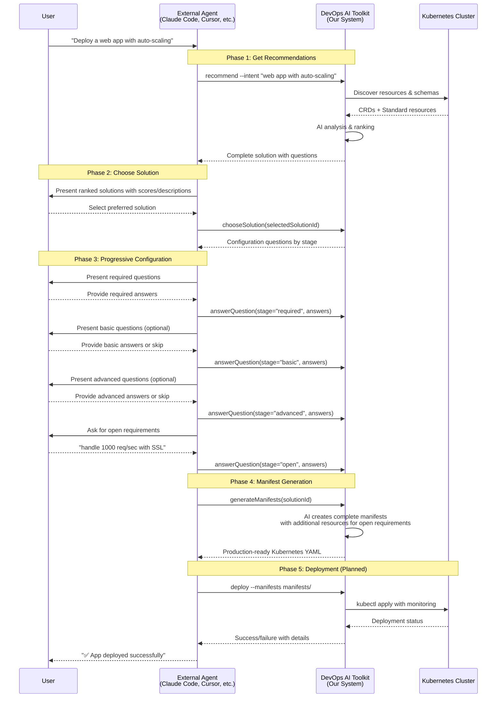

# DevOps AI Toolkit Architecture & Design

## Current Implementation Status

**🟢 IMPLEMENTED**: Resource Schema Parser & Validator with AI-powered recommendations
**🟢 IMPLEMENTED**: Stage-based MCP workflow with conversational deployment
**🟢 IMPLEMENTED**: AI-powered manifest generation with validation
**🟡 IN PROGRESS**: CLI interface with core discovery features  
**🔴 PLANNED**: Deployment Engine, Governance System

## Overview

DevOps AI Toolkit is an intelligent Kubernetes application deployment agent designed to operate in two modes:

1. **✅ CLI Mode** (Current): Standalone command-line tool with AI-powered recommendations
2. **✅ MCP Mode** (Implemented): Model Context Protocol server for conversational deployment workflow

The system implements a discovery-driven workflow powered by Claude AI, evolved from the original inspiration in `ORIGINAL_INSPIRATION.md`.

## External Agent Integration Flow



### Key Design Principles for External Agents

1. **🔄 Session-Based State**: Stateful workflow managed via solutionId
2. **📄 Complete Data Transfer**: Solutions include all necessary schemas and mappings  
3. **🔀 Flexible Workflow**: Agents can skip optional stages as needed
4. **🎯 Progressive Disclosure**: Stage-based configuration (required → basic → advanced → open)
5. **🔍 Transparent Process**: All AI reasoning and schema analysis is visible

## Current Architecture

```
┌────────────────────────────────────────────────────────────┐
│                DevOps AI Toolkit Core                     │
│               (Powered by Claude AI)                       │
│                                                            │
│  ┌───────────────────────────────────────────────────────┐ │
│  │            ✅ IMPLEMENTED COMPONENTS                  │ │
│  │                                                       │ │
│  │  🔍 KubernetesDiscovery                              │ │
│  │    • Cluster resource discovery (CRDs + K8s)         │ │
│  │    • Schema introspection with kubectl explain       │ │
│  │    • Dynamic capability detection                    │ │
│  │                                                       │ │
│  │  🤖 ResourceRecommender (AI-Powered)                │ │
│  │    • Two-phase analysis (selection + ranking)        │ │
│  │    • Standard + CRD resource support                 │ │
│  │    • Context-aware solution scoring                  │ │
│  │                                                       │ │
│  │  ⚡ Stage-Based Workflow Tools                       │ │
│  │    • Progressive question disclosure                 │ │
│  │    • Session state management                        │ │
│  │    • AI-powered manifest generation                  │ │
│  │                                                       │ │
│  │  📋 SchemaParser & ManifestValidator                 │ │
│  │    • kubectl explain output parsing                  │ │
│  │    • Dry-run manifest validation                     │ │
│  │    • Field constraint extraction                     │ │
│  └───────────────────────────────────────────────────────┘ │
│                                                             │
│  ┌─────────────────────┐    ┌───────────────────────────┐ │
│  │  ✅ CLI Interface   │    │  ✅ MCP Mode (Current)    │ │
│  │                     │    │                           │ │
│  │ • recommend command │    │ • Stage-based workflow   │ │
│  │ • discover command  │    │ • Session management     │ │
│  │ • Help system       │    │ • Tool integration       │ │
│  │ • Progress tracking │    │ • Manifest generation    │ │
│  └─────────────────────┘    └───────────────────────────┘ │
└─────────────────────────────────────────────────────────────┘
```

## Core Principles

1. **✅ Discovery-Driven**: Works in any cluster by discovering CRDs and core K8s resources
2. **✅ Resource-Agnostic**: Recommends ANY available Kubernetes resources (AppClaim, CloudRun, Knative, standard K8s, etc.)
3. **🔄 Memory-Enhanced**: (Planned) Learn from successful deployments and failures  
4. **🔄 Dual Interface**: (Planned) Same intelligence, multiple interaction patterns
5. **✅ Zero Hard-coding**: No assumptions about cluster platforms or specific CRDs
6. **✅ AI-Powered**: Uses Claude for intelligent resource selection and manifest generation

## Current Implementation Details

### File Structure
```
src/
├── core/
│   ├── discovery.ts        # ✅ KubernetesDiscovery class
│   ├── schema.ts          # ✅ ResourceRecommender, SchemaParser (SolutionEnhancer moved to /src/legacy/)
│   ├── claude.ts          # ✅ Claude AI integration
│   ├── index.ts           # ✅ Core module exports
│   └── kubernetes-utils.ts # ✅ Shared kubectl utilities
├── interfaces/
│   ├── cli.ts             # ✅ CLI interface and commands
│   └── mcp.ts             # ✅ MCP server (implemented)
├── tools/                 # ✅ MCP workflow tools
│   ├── recommend.ts       # ✅ AI-powered recommendations
│   ├── choose-solution.ts # ✅ Solution selection handler
│   ├── answer-question.ts # ✅ Stage-based configuration
│   └── generate-manifests.ts # ✅ AI manifest generation
└── cli.ts                 # ✅ Main CLI entry point

tests/                     # ✅ 565+ comprehensive tests
docs/                     # ✅ Complete documentation
prompts/                  # ✅ AI prompt templates
```

### Current Commands
```bash
# ✅ Available now  
dot-ai --help                           # Help system (no cluster required)
dot-ai recommend --intent "description" # AI-powered recommendations  
npm run mcp:start                                 # Start MCP server for full workflow

# ✅ MCP Tools (for interactive deployment)
# recommend({ intent: "description" })            # Get AI recommendations
# chooseSolution({ solutionId: "sol_..." })       # Select solution and get questions  
# answerQuestion({ stage: "required", answers })  # Progressive configuration
# generateManifests({ solutionId: "sol_..." })    # AI-generated Kubernetes YAML

# 🔄 Planned
dot-ai deploy --manifests manifests/     # Deployment execution
```

## Universal Extensibility

🔄 **The system adapts to ANY cluster configuration:**

- **Platform Clusters**: GKE with CloudRun, EKS with Lambda, AKS with ContainerApps
- **GitOps Clusters**: ArgoCD Applications, Flux HelmReleases, custom CI/CD CRDs  
- **Serverless Clusters**: Knative Services, OpenFaaS Functions, Fission environments
- **Application Platforms**: DevOpsToolkit AppClaims, Crossplane Compositions, Helm Operator
- **Service Mesh**: Istio VirtualServices, Linkerd ServiceProfiles, custom mesh CRDs
- **Vanilla Kubernetes**: Standard Deployments, Services, Ingress - works everywhere
- **Custom Platforms**: Your organization's custom CRDs and abstractions

> The agent learns the schema of ANY discovered CRD through `kubectl explain` and generates appropriate manifests. No updates needed for new platforms!

## 🔄 Governance & Guardrails (Planned - Task 9)

🗣️ **Plain English governance - no YAML required:**

*Planned feature:* The agent will understand organizational policies written in natural language and apply them throughout the deployment process.

### Policy Template Examples

**Security & Compliance:**
```
# governance/security-policy.txt
Never allow privileged containers in production.
Always require security contexts with non-root users.
All images must come from gcr.io/my-company or registry.my-company.com.
Production deployments must have the labels: security.policy=restricted and compliance=sox.
```

**Resource & Cost Controls:**
```
# governance/resource-policy.txt
Development environments: maximum 3 replicas and 500m CPU per app.
Staging environments: maximum 10 replicas and 2 CPU cores per app.
Production environments: require approval for more than 20 replicas.
Never allow deployments that would cost more than $100/month without approval.
```

**Platform Preferences:**
```
# governance/platform-policy.txt
Prefer AppClaim over standard Kubernetes when available.
Never use AWS Lambda CRDs in our GCP environment.
Always use Knative for serverless workloads when available.
Require ingress capability for all web applications.
```

**Environment Rules:**
```
# governance/environment-policy.txt
Developers can only deploy to namespaces starting with "dev-" or "feature-".
Contractors can only deploy to the "sandbox" namespace.
Production deployments require approval from the platform team.
All applications must have monitoring enabled.
```

### How It Works

**1. Policy Loading:**
```bash
# Agent reads plain English policies
dot-ai config set governance.policy-files "./governance/*.txt"
dot-ai governance validate  # Checks if policies are understood
```

**2. Runtime Application:**
The agent interprets policies contextually during each workflow step:

- **Discovery**: "Never use AWS Lambda CRDs" → filters out Lambda CRDs
- **Strategy**: "Prefer AppClaim over standard Kubernetes" → ranks AppClaim higher
- **Configuration**: "Maximum 3 replicas in development" → validates user input
- **Generation**: "Always require security contexts" → injects required fields
- **Deployment**: "Require approval for >$100/month" → triggers approval workflow

**3. Interactive Enforcement:**
```
$ dot-ai recommend --intent "web app with 10 replicas"

🛡️ Policy Check: Development limit is 3 replicas maximum.
   Would you like to:
   1. Use 3 replicas instead (recommended)
   2. Request approval for 10 replicas  
   3. Deploy to staging environment instead

Your choice [1]: 
```

### Template System

**Starter Templates:**
```bash
# Initialize with common templates
dot-ai governance init --template=startup
dot-ai governance init --template=enterprise  
dot-ai governance init --template=regulated-industry
```

**Custom Templates:**
```
# governance/startup-template.txt
Keep costs low - maximum 2 replicas and 200m CPU in development.
All images must be scanned for vulnerabilities.
Prefer managed services over self-hosted when available.

# governance/enterprise-template.txt  
All deployments must have cost-center and team labels.
Production requires approval from security and platform teams.
Enforce pod security standards and network policies.
Audit all deployments with compliance labels.

# governance/regulated-template.txt
All containers must run as non-root with read-only file systems.
Require approval for any external network access.
All deployments must be logged and auditable.
Encrypt all data at rest and in transit.
```

### Benefits

✅ **User-Friendly**: No YAML or complex syntax to learn  
✅ **Expressive**: Natural language is more flexible than rigid schemas  
✅ **Maintainable**: Easy to read, understand, and modify policies  
✅ **AI-Native**: Leverages the agent's natural language understanding  
✅ **Context-Aware**: Agent applies policies intelligently based on situation  
✅ **Progressive**: Start simple, add complexity as needed  

> **Key Insight**: Since the agent is AI-powered, governance should be too. Let users express their intent in natural language, and let the AI figure out how to enforce it.

## Mode Comparison

| Aspect | Direct Agent Mode | MCP Mode |
|--------|------------------|----------|
| **User Interaction** | Direct Q&A with user | Structured guidance to calling agent |
| **Session Management** | Built-in via Claude Code SDK | Stateless function calls |
| **Output Format** | Human-readable text | JSON with workflow guidance |
| **Use Case** | Standalone deployment tool | Integration with other AI agents |
| **Complexity** | Simple CLI usage | Requires MCP-aware agent |

## Current Workflow

### 1. ✅ Cluster Discovery (Implemented)
The KubernetesDiscovery class automatically discovers:

```typescript
// Discover CRDs with comprehensive metadata
const crds = await discovery.discoverCRDs();

// Get all API resources
const resources = await discovery.getAPIResources();

// Analyze resource schemas
const schema = await discovery.explainResource('Deployment');

// Dynamic capability detection
const clusterOptions = await discovery.discoverClusterOptions();
// Returns: namespaces, storageClasses, ingressClasses, nodeLabels
```

**Current Discovery Features:**
- ✅ CRD discovery with schema analysis
- ✅ Standard K8s resource enumeration  
- ✅ Dynamic cluster capability detection
- ✅ Schema introspection via kubectl explain
- ✅ Namespace/storage/ingress discovery

### 2. ✅ AI-Powered Resource Selection (Implemented)
ResourceRecommender uses two-phase AI analysis:

```typescript
// Phase 1: AI selects promising candidates from lightweight resource list
const candidates = await recommender.selectResourceCandidates(intent, allResources);

// Phase 2: Fetch detailed schemas and rank with AI
const schemas = await recommender.fetchDetailedSchemas(candidates, explainResource);
const solutions = await recommender.rankWithDetailedSchemas(intent, schemas);
```

**Current Resource Support:**
- ✅ **CRDs**: AppClaim, CloudRun, Knative, Crossplane, ArgoCD, custom resources
- ✅ **Standard K8s**: Deployment, Service, Ingress, HPA, Job, CronJob
- ✅ **Mixed scenarios**: AI recommends both standard + custom resources
- ✅ **Ranking**: Scores solutions based on intent match and capabilities

### 3. ✅ Dynamic Question Generation (Implemented)
Questions are generated based on resource schemas and user intent:

```typescript
// Generate contextual questions
const questions = await recommender.generateQuestionsWithAI(solution, intent, clusterOptions);

// Returns categorized questions:
// - required: Essential for basic functionality
// - basic: Common configuration options  
// - advanced: Power user optimizations
// - open: Free-form requirement capture
```

**Current Question Features:**
- ✅ Schema-driven question generation
- ✅ Dynamic cluster options (real namespaces, storage classes)
- ✅ Progressive disclosure (required → basic → advanced)
- ✅ Open-ended requirement capture
- ✅ ResourceMapping for manifest generation

### 4. ✅ Stage-Based Configuration (Implemented)  
Progressive question answering through MCP tools:

```typescript
// Stage-based workflow through MCP tools:
// 1. answerQuestion({ stage: "required", answers: {...} })
// 2. answerQuestion({ stage: "basic", answers: {...} })  
// 3. answerQuestion({ stage: "advanced", answers: {...} })
// 4. answerQuestion({ stage: "open", answers: { "open": "auto-scaling for 1000 requests/sec" } })
// 5. generateManifests({ solutionId: "sol_..." })

// Results in:
// - Session-based state management via solutionId
// - Progressive disclosure of configuration options
// - AI-generated manifests with additional resources for open requirements
```

**Current Stage-Based Features:**
- ✅ Progressive question disclosure (required → basic → advanced → open)
- ✅ Session state management via solutionId
- ✅ Open-ended requirement processing in final stage
- ✅ AI-powered manifest generation with validation
- ✅ Support for skipping optional stages

## 🔄 Planned Features

### ✅ Manifest Generation (Implemented)
```typescript
// AI-generated manifests via MCP tool
generateManifests({ solutionId: "sol_..." })

// Implemented features:
// ✅ Schema-aware AI generation (no templates)
// ✅ Dynamic resource addition based on open requirements
// ✅ kubectl dry-run validation with retry loop
// ✅ Support for any CRD type (AppClaim, Crossplane, etc.)
// ✅ Production-ready YAML output
```

### Deployment Engine (Task 8)
```bash
# Deploy generated manifests with monitoring
dot-ai deploy --manifests manifests/ --watch

# Features planned:
# - kubectl apply with progress tracking
# - Resource readiness monitoring
# - Rollback capabilities
# - Success/failure learning
```

### Memory & Learning System (Task 4)
```typescript
// Learn from deployment outcomes
await memory.storePattern(solution, outcome, clusterFingerprint);
await memory.storeLessons(deployment, lessons);

// Apply learned patterns
const patterns = await memory.getSimilarPatterns(currentSolution);
```

### ✅ MCP Server Mode (Implemented)
```typescript
// MCP tools for external agents (stage-based workflow)
const server = new MCPServer();
server.addTool('recommend', recommendHandler);
server.addTool('chooseSolution', chooseSolutionHandler);
server.addTool('answerQuestion', answerQuestionHandler);
server.addTool('generateManifests', generateManifestsHandler);
```

> **Note**: The system is completely extensible - it will work with ANY Kubernetes resources (CRDs or core) available in your cluster. The examples above are just common patterns.

### 3. Configuration Gathering
**Dynamic questions based on discovered resource schemas + user requirements:**

The agent analyzes the chosen resource's schema (`kubectl explain <resource>`) and the user's description to generate contextual questions.

**Examples of dynamic questioning:**

**If AppClaim CRD is chosen:**
```bash
kubectl explain appclaim.spec
# Discovers: image, port, host, replicas, resources fields
```
- "What's your container image?" (required by schema)
- "What port does your app listen on?" (required by schema)  
- "Do you want a custom domain or auto-generated?" (based on host field options)
- "How many replicas initially?" (optional field, asks only if user mentioned scaling)

**If CloudRunService CRD is chosen:**
```bash
kubectl explain cloudrunservice.spec.template.spec
# Discovers: serverless-specific fields, traffic allocation, etc.
```
- "What's your container image?" (required)
- "What's your service port?" (required)
- "Do you want traffic splitting?" (only asks if schema supports it)
- "CPU/Memory limits?" (asks based on schema constraints)

**If standard Kubernetes is chosen:**
```bash
kubectl explain deployment.spec.template.spec.containers
kubectl explain service.spec
kubectl explain ingress.spec
```
- "Container image?" (Deployment requirement)
- "Service type: ClusterIP, LoadBalancer, or NodePort?" (based on available ServiceTypes)
- "Need external access?" (only if Ingress CRD exists)
- "Enable auto-scaling?" (only if HPA CRD exists)

**If custom CRD `MyPlatformApp` is discovered:**
```bash
kubectl explain myplatformapp.spec
# System learns: whatever fields exist in this custom resource
```
- Questions generated dynamically from the schema
- User description influences which optional fields to ask about

**User Intent Influences Questions:**

If user says: `"web app with auto-scaling"` → Asks about HPA settings (if available)
If user says: `"batch job that runs nightly"` → Focuses on CronJob fields, doesn't ask about services
If user says: `"microservice with database"` → Asks about ConfigMaps, Secrets, storage
If user says: `"simple web app"` → Asks minimal questions, uses smart defaults

> **Key**: Questions are never static - they're generated by analyzing resource schemas and matching them to user intent.

### 4. Manifest Generation
- Generate manifests using discovered CRD schemas
- Apply memory lessons (ELB→IP resolution, resource patterns, etc.)
- Validate against cluster capabilities

### 5. Deployment & Monitoring
- Deploy resources
- Monitor until healthy/failed
- Store lessons learned for future use

## Direct Agent Mode

The Direct Agent Mode provides a standalone CLI tool called `dot-ai` that users can install and run directly.

### Installation & Usage
```bash
# Install the CLI tool globally
npm install -g dot-ai

# Get AI-powered deployment recommendations
dot-ai recommend --intent "web app with auto-scaling"

# Choose solution and configure step-by-step
dot-ai choose-solution --solution-id sol_xxx --session-dir ./tmp

# Generate and deploy manifests
dot-ai generate-manifests --solution-id sol_xxx --session-dir ./tmp
dot-ai deploy-manifests --solution-id sol_xxx --session-dir ./tmp

# Check status of a deployment
dot-ai status my-app
```

> **Note**: `dot-ai` is the proposed CLI command name. Alternative names could be `kubectl-app-deploy`, `kube-app`, `k8s-dot-ai`, etc.

### Example Interaction
```
$ dot-ai recommend --intent "web app with auto-scaling"

🔍 Discovering cluster capabilities...
✅ Found: AppClaim (DevOpsToolkit), CloudRunService (GCP), Standard K8s
   (Note: This varies per cluster - could be Knative, ArgoCD, or any other CRDs)

🤔 I can deploy your web app using:
   1. AppClaim (recommended) - Managed by DevOpsToolkit
   2. CloudRunService - Serverless on GCP  
   3. Standard Kubernetes - Manual configuration

Which would you prefer? [1]: 1

📝 Using AppClaim for managed deployment.
   (Questions generated from `kubectl explain appclaim.spec`)
What's your container image? nginx:latest
What port does your app listen on? [80]: 80
Do you want auto-scaling? [Y/n]: Y
   Note: Different CRDs = different questions based on their schemas

🚀 Generating AppClaim manifest...
✅ Generated manifest with lessons applied:
   - Host: my-app.12.34.56.78.nip.io (resolved ELB to IP)
   - Resources: CPU 100m-500m, Memory 128Mi-512Mi (AKS baseline)

Deploy now? [Y/n]: Y

🎯 Deploying...
⏳ Waiting for AppClaim to create App composite...
⏳ Waiting for pods to be ready...
✅ Deployment successful!

🌐 Your app is running at: https://my-app.12.34.56.78.nip.io

💾 Stored lessons learned for future deployments.
```

## MCP Mode

### MCP Functions

#### `create_application`
Entry point - discovers cluster and returns initial guidance
```typescript
// Input: {}
// Output: 
{
  cluster_discovery: {
    available_crds: [...],
    deployment_strategies: [...]
  },
  agent_question: {
    question: "I found AppClaim and CloudRun. Which platform?",
    options: ["appclaim", "cloudrun", "kubernetes"],
    reasoning: "AppClaim provides managed deployment, CloudRun is serverless",
    note: "Available options vary per cluster based on discovered CRDs"
  },
  workflow_guidance: {
    next_action: "await_user_choice",
    expected_input: "platform_choice"
  }
}
```

#### `continue_workflow`
Continue based on user input - questions generated from resource schema
```typescript
// Input: { user_choice: "appclaim", context: {...} }
// Agent runs: kubectl explain appclaim.spec
// Output:
{
  progress: "platform_selected",
  agent_question: {
    question: "What's your container image?",
    validation: "Must be valid container image format",
    schema_context: "Required field in appclaim.spec.image",
    why_asking: "AppClaim schema requires container image specification"
  },
  workflow_guidance: {
    next_action: "await_user_input",
    expected_input: "container_image"
  }
}

// Different resource = different questions
// Input: { user_choice: "knativeservice", context: {...} }
// Agent runs: kubectl explain knativeservice.spec.template.spec.containers
// Output:
{
  progress: "platform_selected", 
  agent_question: {
    question: "What's your container image and what environment variables do you need?",
    validation: "Image format: registry/image:tag, EnvVars: KEY=value pairs",
    schema_context: "KnativeService requires image, envVars are common",
    why_asking: "Knative schema analysis shows these are typical requirements"
  },
  workflow_guidance: {
    next_action: "await_user_input",
    expected_input: "container_config"
  }
}
```

#### `deploy_application`
Execute deployment when ready
```typescript
// Input: { config: {...} }
// Output:
{
  deployment_status: "in_progress",
  deployment_id: "abc123",
  monitoring_guidance: {
    next_action: "poll_status",
    poll_interval: "10s",
    timeout: "300s"
  }
}
```

#### `get_deployment_status`
Monitor deployment progress
```typescript
// Input: { deployment_id: "abc123" }
// Output:
{
  status: "healthy" | "deploying" | "failed",
  resources: [...],
  access_url: "https://my-app.12.34.56.78.nip.io",
  lessons_learned: [...]
}
```

### MCP Usage Example
```typescript
// External agent using the MCP
const mcp = new AppManagementMCP();

// Start workflow
const initial = await mcp.create_application();
// Returns: "I found AppClaim and CloudRun. Which platform?"

// Agent asks user, gets "appclaim"
const step2 = await mcp.continue_workflow({
  user_choice: "appclaim", 
  context: initial.context
});
// Returns: "What's your container image?"

// Continue until ready to deploy
const final = await mcp.deploy_application({
  config: gatheredConfig
});
// Returns: deployment status and monitoring guidance
```

## Implementation Technology

### Claude Code SDK
- **Primary Engine**: All agent intelligence powered by Claude Code SDK
- **Session Management**: Built-in conversation state handling
- **JSON Output**: Perfect for MCP structured responses
- **Multi-turn**: Handles complex deployment workflows
- **Tool Integration**: Can call kubectl, validate manifests, etc.

### Architecture Components
- **Agent Core**: Claude Code SDK with Kubernetes system prompt
- **Mode Switch**: Runtime configuration for output format
- **CRD Discovery**: Dynamic cluster capability detection
- **Memory System**: JSON-based lesson storage and retrieval
- **Workflow Engine**: State machine for deployment process

## File Structure
```
dot-ai/
├── docs/                   # Documentation
│   ├── design.md           # Architecture and workflow
│   ├── CONTEXT.md          # Quick reference for new sessions
│   └── ORIGINAL_INSPIRATION.md  # Starting prompt (reference only)
├── src/
│   ├── agent/              # Core agent logic
│   │   ├── core.ts         # Claude Code SDK wrapper
│   │   ├── discovery.ts    # CRD discovery and analysis
│   │   ├── memory.ts       # Lesson storage/retrieval
│   │   └── workflow.ts     # Deployment state machine
│   ├── modes/              # Output mode handlers
│   │   ├── direct.ts       # CLI direct interaction
│   │   └── mcp.ts          # MCP server functions
│   ├── utils/              # Utilities
│   │   ├── kubectl.ts      # Kubernetes API wrapper
│   │   ├── manifest.ts     # Manifest generation
│   │   └── validation.ts   # Schema validation
│   └── types/              # TypeScript definitions
├── templates/              # Manifest templates (fallbacks)
├── memory/                 # Lesson storage
├── config/                 # Configuration files
└── bin/                    # CLI entry points
    ├── dot-ai           # Direct mode CLI executable
    └── dot-ai-mcp       # MCP server executable
```

## Next Steps

1. **Define detailed API specifications** for all MCP functions
2. **Create implementation guide** with Claude Code SDK integration
3. **Design memory system** for lesson storage and retrieval
4. **Plan testing strategy** for both modes
5. **Document deployment and configuration** requirements 