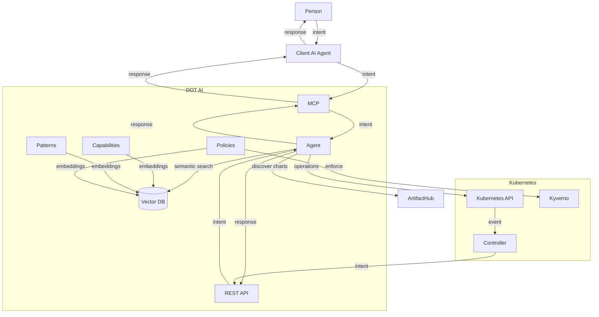

# Agents Architecture

## System Diagram

## Description

This diagram illustrates the relationships between agents in the system.

### Components

- **Person**: End user interacting through natural language
- **Client AI Agent**: MCP-enabled coding assistant (Claude Code, Cursor, VS Code)
- **MCP**: Model Context Protocol interface for AI tool integration
- **REST API**: HTTP endpoints for CI/CD pipelines, controllers, and automation
- **Agent**: Core AI-powered orchestration engine
- **Capabilities**: Semantic descriptions of cluster resources stored in Vector DB
- **Patterns**: Organizational deployment templates with best practices
- **Policies**: Governance rules that guide recommendations and optionally enforce via Kyverno
- **Vector DB**: Qdrant database for semantic search across capabilities, patterns, and policies
- **Kubernetes API**: Cluster operations (deploy, remediate, operate)
- **Kyverno**: Policy enforcement engine for active governance
- **Controller**: [dot-ai-controller](https://github.com/vfarcic/dot-ai-controller) for event-driven remediation
- **ArtifactHub**: External Helm chart repository for third-party tool discovery