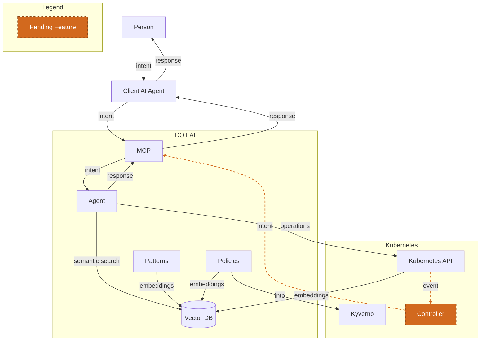

# Agents Architecture

## System Diagram

```mermaid
graph TD
    Person[Person]
    ClientAI[Client AI Agent]
    
    subgraph "DOT AI"
        DotAI[Agent]
        Patterns[Patterns]
        VectorDB[(Vector DB)]
        Policies[Policies]
        MCP[MCP]
    end
    
    subgraph Kubernetes
        K8sAPI[Kubernetes API]
        Kyverno[Kyverno]
        Controller[Controller]:::pending
    end
    
    Person -->|intent| ClientAI
    ClientAI -->|response| Person
    
    ClientAI -->|intent| MCP
    MCP -->|intent| DotAI
    DotAI -->|response| MCP
    MCP -->|response| ClientAI
    
    DotAI -->|semantic search| VectorDB
    DotAI -->|operations| K8sAPI
    K8sAPI -.->|event| Controller
    Controller -.->|intent| MCP
    K8sAPI -->|embeddings| VectorDB
    
    %% Style the pending links
    linkStyle 8 stroke:#D2691E,stroke-width:2px,stroke-dasharray: 5 5
    linkStyle 9 stroke:#D2691E,stroke-width:2px,stroke-dasharray: 5 5
    Patterns -->|embeddings| VectorDB
    Policies -->|embeddings| VectorDB
    Policies -->|into| Kyverno
    
    %% Styling for future/pending features
    classDef pending fill:#D2691E,stroke:#8B4513,color:#FFFFFF,stroke-width:2px,stroke-dasharray: 5 5
    
    %% Legend
    subgraph Legend
        PendingFeature[Pending Feature]:::pending
    end
```

## Description

This diagram illustrates the relationships between agents in the system.