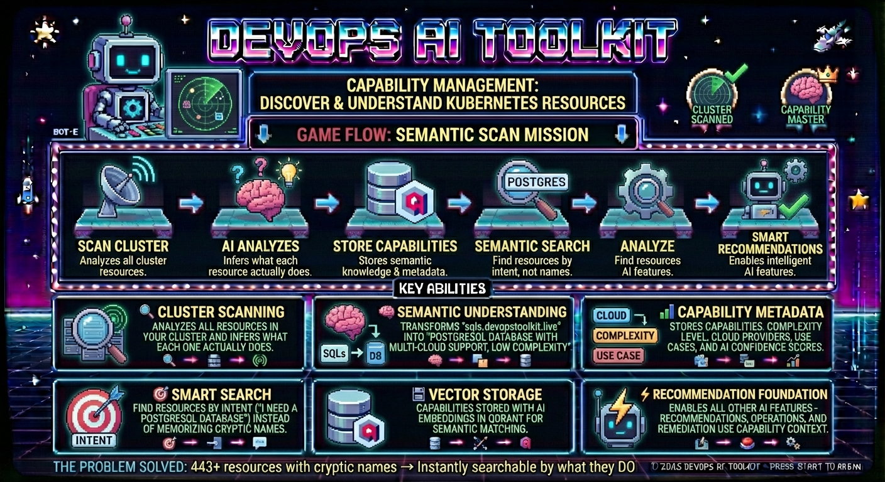

# Capability Management Guide

<!-- dotai-test-hint: Test all capability management workflows using mcp__dot-ai__manageOrgData tool with dataType="capabilities" and various operations (scan, list, get, search, delete, deleteAll, progress) to verify documented examples match actual tool behavior. For scanning, use "specific" subset with 1-2 test resources, NOT "all" as full cluster scans take too long -->

**Complete guide for discovering, managing, and leveraging Kubernetes resource capabilities with the DevOps AI Toolkit.**



## Overview

Capability Management transforms how the DevOps AI Toolkit understands your Kubernetes cluster by discovering and storing semantic information about what each resource actually does. Instead of treating resources as generic names, the system learns their capabilities, providers, complexity, and use cases - enabling intelligent, context-aware deployment recommendations.

### What is Capability Management?

Traditional Kubernetes deployment tools see resources like `sqls.devopstoolkit.live` as meaningless names among all the resources in your cluster. Capability Management teaches the system that `sqls.devopstoolkit.live` is actually a PostgreSQL database solution with low complexity, supporting multiple cloud providers.

**The Problem**: 
```
User: "I need a PostgreSQL database"
AI: Gets all cluster resources [sqls.devopstoolkit.live, Deployment, StatefulSet, Service, ...]
AI: Must analyze each resource individually to understand what it does
AI: Often makes poor matches due to overwhelming choices and lack of context
Result: Suboptimal recommendations based on incomplete understanding
```

**The Solution**:
```
User: "I need a PostgreSQL database" 
System: Semantic search finds database-relevant resources with rich context
AI: Gets pre-filtered candidates that actually match the intent
AI: Makes informed decisions using capability context (postgresql, complexity, providers)
Result: Optimal recommendations whether using 1 resource, 5 resources, or 50 resources
```

### How It Works

1. **Capability Discovery** → System analyzes your cluster resources and infers what each one does
2. **Semantic Storage** → Capabilities are stored with AI-generated embeddings for intelligent matching  
3. **Smart Recommendations** → Deployment requests get pre-filtered, relevant resources with rich context
4. **Informed AI Decisions** → AI makes better choices based on capability understanding

## See the Problem in Action

[](https://youtu.be/MSNstHj4rmk)

This video demonstrates the real-world challenge of discovering the right Kubernetes resources when you have hundreds of cryptically named resource types in your cluster. Watch how both humans and AI struggle with traditional keyword-based searching through 443+ resources, and see how semantic search with vector databases transforms an unsearchable cluster into an instantly discoverable one where you can describe what you want to accomplish rather than memorizing cryptic resource names.

### Understanding Organizational Data Types

Capability Management provides the foundation for other organizational intelligence features in the DevOps AI Toolkit.

**Quick Overview**:
- **Capabilities**: What resources can do (this guide - required foundation)
- **Patterns**: What resources to deploy together (organizational preferences)  
- **Policies**: How resources should be configured (governance requirements)

For a complete understanding of how these three types work together, see the **[Organizational Data Concepts Guide](organizational-data-concepts.md)**.

## Prerequisites

Before using Capability Management, ensure you have:

### Required Setup
- **DevOps AI Toolkit MCP server** configured (see [MCP Setup Guide](../setup/mcp-setup.md))
- **Vector DB service** (Qdrant) for capability storage and semantic search
- **AI integration** for capability inference (see [AI Model Configuration](../setup/mcp-setup.md#ai-model-configuration) for supported models and API keys)
- **Kubernetes cluster access** for resource discovery and schema analysis

### Optional Enhancements  
- **Embedding provider** configured for semantic search (see [Embedding Provider Configuration](../setup/mcp-setup.md#embedding-provider-configuration) for options)
- **Organizational patterns** for enhanced recommendations (see [Pattern Management Guide](pattern-management-guide.md))

For complete setup instructions, see the [MCP Setup Guide](../setup/mcp-setup.md).

## Scanning Methods

There are two ways to scan cluster capabilities. Choose based on whether your MCP server is accessible from within the Kubernetes cluster.

### Method 1: Controller-Based Scanning (Recommended)

**Use when**: MCP server is deployed in Kubernetes or accessible via a URL from within the cluster.

The dot-ai-controller provides autonomous, event-driven capability scanning. Once configured, it automatically:
- Scans all cluster resources on startup
- Watches for CRD changes (create/update/delete)
- Keeps capabilities up-to-date without manual intervention

**Setup**:

1. Install the controller (if not already installed via Helm):
   ```bash
   helm install dot-ai-controller \
     oci://ghcr.io/vfarcic/dot-ai-controller/charts/dot-ai-controller \
     --namespace dot-ai --create-namespace --wait
   ```

2. Create a `CapabilityScanConfig` to start scanning:
   ```yaml
   apiVersion: dot-ai.devopstoolkit.live/v1alpha1
   kind: CapabilityScanConfig
   metadata:
     name: default-scan
     namespace: dot-ai
   spec:
     mcp:
       endpoint: http://dot-ai-mcp.dot-ai.svc.cluster.local:3456/api/v1/tools/manageOrgData
       authSecretRef:
         name: dot-ai-secrets
         key: auth-token
   ```

3. Apply the configuration:
   ```bash
   kubectl apply -f capabilityscanconfig.yaml
   ```

The controller will immediately begin scanning all cluster resources. Monitor progress with:
```bash
kubectl logs -n dot-ai -l app.kubernetes.io/name=dot-ai-controller --tail=100
```

**Benefits**:
- Fully autonomous - no manual scanning required
- Event-driven - new CRDs are scanned automatically when installed
- Resilient - retries failed operations with exponential backoff

For complete controller documentation, see the [Capability Scan Guide](https://devopstoolkit.ai/docs/controller/capability-scan-guide).

### Method 2: Manual Scanning via MCP

**Use when**: MCP server is NOT accessible from within the cluster (e.g., running locally on your laptop, Docker Desktop, or behind NAT).

When the controller cannot reach your MCP server, use the interactive scanning workflow through your MCP client. This approach requires you to manually trigger scans when cluster resources change.

Discover and analyze all resources in your Kubernetes cluster through a complete workflow:

#### Initial Setup
```
User: I want to scan my cluster for resource capabilities

Agent: Would you like to scan all cluster resources or specify a subset?

Options:
1. All resources - Comprehensive analysis of all cluster resources
2. Specific subset - Choose specific resource types for focused analysis
```

#### Scanning Workflow Options

**Complete Cluster Analysis (Recommended)**
```
User: All resources

Agent: How would you like to process the resources?

Options:
1. Auto mode - Batch process all resources automatically (recommended for production)  
2. Manual mode - Review each capability analysis individually (useful for testing/validation)

User: Auto mode

Agent: Starting comprehensive cluster capability scan...

[Scanning happens in background - no progress updates shown]

Agent: ✅ Capability scan completed successfully! Processed cluster resources.

Your cluster capabilities are now available for intelligent deployment recommendations.
```

**Focused Resource Scanning**
```
User: Specific subset

Agent: Please provide specific resource list (comma-separated):
Format: Kind.group for CRDs, Kind for core resources
Examples: sqls.devopstoolkit.live, deployments.apps, services

User: sqls.devopstoolkit.live, server.dbforpostgresql.azure.upbound.io, persistentvolumeclaims

Agent: How would you like to process these 3 resources?

Options:
1. Auto mode - Batch process automatically 
2. Manual mode - Review each analysis individually

User: Manual mode

Agent: Starting focused capability scan for 3 resources in manual mode...

🔍 **Analyzing Resource 1/3: sqls.devopstoolkit.live**

**AI Analysis Results:**
🎯 Capabilities: postgresql, mysql, database, multi-cloud
📊 Complexity: low | Confidence: 85%
📝 Description: Managed database solution supporting multiple engines and cloud providers
🔧 Use Case: Simple database deployment without infrastructure complexity

Continue storing this capability?
Options:
1. yes - Store this capability 
2. no - Skip this resource
3. stop - End scanning process

User: yes

Agent: ✅ Stored capability for sqls.devopstoolkit.live

🔍 **Analyzing Resource 2/3: server.dbforpostgresql.azure.upbound.io**

**AI Analysis Results:**
🎯 Capabilities: postgresql, database, azure infrastructure  
📊 Complexity: medium | Confidence: 90%
📝 Description: Native Azure PostgreSQL service via Crossplane
🔧 Use Case: Production PostgreSQL with Azure integration

Continue storing this capability?
Options:
1. yes - Store this capability
2. no - Skip this resource  
3. stop - End scanning process

User: yes

Agent: ✅ Stored capability for server.dbforpostgresql.azure.upbound.io

🔍 **Analyzing Resource 3/3: persistentvolumeclaims**

**AI Analysis Results:**
🎯 Capabilities: storage, persistent volumes, data persistence
📊 Complexity: medium | Confidence: 95%
📝 Description: Kubernetes persistent storage abstraction
🔧 Use Case: Application data persistence and storage management

Continue storing this capability?
Options:
1. yes - Store this capability
2. no - Skip this resource
3. stop - End scanning process

User: yes

Agent: ✅ Stored capability for persistentvolumeclaims

🎯 **Manual Scan Complete!**
✅ Successfully analyzed and stored 3/3 capabilities
⏱️ Total time: 2 minutes 15 seconds
📊 All selected resources now have capability metadata for enhanced recommendations
```

## Working with Capabilities

Regardless of which scanning method you use, all capability operations (monitoring progress, listing, searching, etc.) are done through the MCP client.

### Monitor Scanning Progress

```
User: Check the progress of my capability scan

Agent: [Uses manageOrgData with dataType: "capabilities", operation: "progress"]

**Capability Scan Progress**

⏳ Status: Processing - 20/79 resources (25%)
📊 Current resource: ResourceSyncConfig.dot-ai.devopstoolkit.live
⏰ Est. remaining: 5.6 minutes
🕒 Started: 2025-12-25T18:28:37Z

---

When complete:

✅ Status: Completed
📊 Processed: 79 resources
⏰ Processing time: 8 minutes
🕒 Started: 2025-12-25T18:30:08.782Z
✔️ Completed: 2025-12-25T18:38:06.489Z
```

### List Discovered Capabilities

View all capabilities that have been discovered and stored:

```
User: How many capabilities do we have?

Agent: [Uses manageOrgData with dataType: "capabilities", operation: "list"]

You have 15 capabilities stored in the system. Here are the first 10:

| Resource                         | Group                        | Complexity | Capabilities                                  |
|----------------------------------|------------------------------|------------|-----------------------------------------------|
| CronJob                          | batch                        | medium     | scheduled jobs, cron, batch processing        |
| ValidatingAdmissionPolicy        | admissionregistration.k8s.io | high       | admission control, policy validation          |
| Lease                            | coordination.k8s.io          | high       | leader election, distributed coordination     |
| ValidatingWebhookConfiguration   | admissionregistration.k8s.io | high       | admission control, webhook, validation        |
| SelfSubjectReview                | authentication.k8s.io        | low        | user authentication, identity verification    |
| RuntimeClass                     | node.k8s.io                  | medium     | container runtime, runtime configuration      |
| ValidatingAdmissionPolicyBinding | admissionregistration.k8s.io | high       | admission control, policy enforcement         |
| PodDisruptionBudget              | policy                       | medium     | availability management, pod eviction control |
| RoleBinding                      | rbac.authorization.k8s.io    | medium     | rbac, authorization, access control           |
| Role                             | rbac.authorization.k8s.io    | medium     | rbac, permissions, security                   |
```

### Search for Specific Capabilities

Search stored capabilities using natural language queries:

```
User: Search for postgresql database in Azure

Agent: [Uses manageOrgData with dataType: "capabilities", operation: "search", id: "postgresql database in Azure"]

**Capability Search Results** for "postgresql database in Azure":

🥇 **Score: 0.95** - sqls.devopstoolkit.live
🎯 Capabilities: postgresql, mysql, database, multi-cloud
📊 Complexity: low | Confidence: 85%
📝 Perfect match for PostgreSQL with multi-cloud support

🥈 **Score: 0.87** - server.dbforpostgresql.azure.upbound.io  
🎯 Capabilities: postgresql, database, azure infrastructure
📊 Complexity: medium | Confidence: 90%
📝 Native Azure PostgreSQL service via Crossplane

🥉 **Score: 0.72** - postgresql.postgresql.cnpg.io
🎯 Capabilities: postgresql, database, high availability
📊 Complexity: high | Confidence: 95% 
📝 Cloud Native PostgreSQL operator for production

**Found 8 total matches.** The top results show resources specifically designed for PostgreSQL deployments with varying complexity levels.
```

### Get Detailed Capability Information

Retrieve complete information using a specific capability ID (obtained from list or search results):

```
User: Show me detailed information for capability ID a1b2c3d4-5e6f-7890-abcd-ef1234567890

Agent: [Uses manageOrgData with dataType: "capabilities", operation: "get", id: "a1b2c3d4-5e6f-7890-abcd-ef1234567890"]

**Resource Capability Details**

## Resource Information
**Resource Name:** sqls.devopstoolkit.live
**Description:** Managed database solution supporting multiple engines and cloud providers
**Use Case:** Simple database deployment without infrastructure complexity

## Capabilities & Features  
**Primary Capabilities:** postgresql, mysql, database, multi-cloud
**Cloud Providers:** azure, gcp, aws
**Abstractions:** managed service, high availability, backup automation
**Complexity Level:** low (user-friendly, minimal configuration required)

## Technical Details
**AI Confidence Score:** 85% (high confidence in capability analysis)
**Last Analyzed:** 2025-08-07T10:30:00.000Z
**Capability ID:** a1b2c3d4-5e6f-7890-abcd-ef1234567890

This resource is ideal for teams wanting database solutions without managing underlying infrastructure complexity.
```

## Integration with Deployment Recommendations

<!-- dotai-ignore: This section is primarily referential - testing is done in the recommendation guide -->

Once capabilities are discovered and stored, they automatically enhance deployment recommendations by providing semantic context about each resource's purpose and complexity. This enables the AI to make smarter, more informed suggestions tailored to your specific cluster capabilities.

**For complete examples and workflows**, see the [Recommendation Guide](mcp-recommendation-guide.md).

## Capability Management Operations

### List All Capabilities
```
User: List all discovered capabilities

Agent: [Returns paginated list of all stored capabilities with IDs for reference]
```

### Search Capabilities by Intent
```
User: Find resources for "microservice deployment with autoscaling"

Agent: [Returns ranked list of resources that match the semantic intent]
```

### Get Specific Capability Details
```
User: Show me details for capability ID cap-deployments-apps

Agent: [Returns complete capability information for the specified resource]
```

### Delete Individual Capabilities  
```
User: Delete the capability for old-unused-resource.example.com

Agent: [Removes the specific capability while preserving others]
```

### Delete All Capabilities
```
User: Clear all capability data and start fresh

Agent: [Removes all stored capabilities - useful for rescanning after major cluster changes]
```

### Monitor Long-Running Operations
```
User: Check the status of my capability scan

Agent: [Shows progress, completion estimates, and any errors during processing]
```

## Next Steps

Once your cluster capabilities are discovered and managed:

1. **Enhanced Recommendations**: Use deployment recommendations to get intelligent suggestions based on your discovered capabilities
2. **Explore Other Tools**: See the [Tools and Features Overview](mcp-tools-overview.md) to browse all available tools including pattern management, policy governance, and issue remediation
