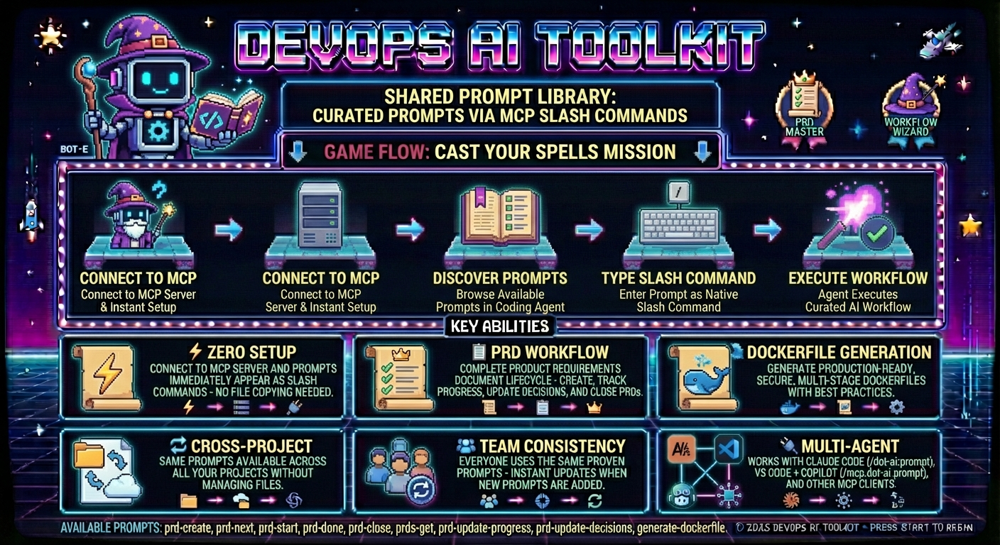

# Shared Prompt Library

<!-- PRD-29 -->



## What are MCP Prompts

MCP Prompts provide a centralized way to share and discover prompts across projects and team members. Instead of manually copying prompt files between projects, prompts are served directly through the dot-ai MCP server and automatically appear as native slash commands in MCP-enabled coding agents.

**Key Benefits:**
- **Zero setup**: Connect to MCP server and prompts are immediately available
- **Native integration**: Prompts appear as slash commands in your coding agent's command menu
- **Cross-project sharing**: Same prompts available across all projects without file management
- **Instant updates**: New prompts added to server are immediately available to all users
- **Team consistency**: Everyone uses the same proven prompts

## Prerequisites

Before using MCP Prompts, you need:
- **MCP-enabled coding agent** (Claude Code, Cursor, or VS Code with MCP extension)  
- **Successfully configured dot-ai MCP server connection**

**Setup Required**: Follow the [MCP Setup Guide](../setup/mcp-setup.md) to configure your environment before proceeding.

**Note**: The Anthropic API key is only required for AI-powered tools (like deployment recommendations), not for using the shared prompts library.

## How It Works

The dot-ai MCP server implements the standard MCP Prompts specification, exposing two key endpoints:

- **`prompts/list`**: Returns all available prompts with metadata
- **`prompts/get`**: Returns specific prompt content by ID

When you connect to the MCP server, your coding agent automatically discovers available prompts and makes them accessible through agent-specific interfaces. The access method varies by agent - some use slash commands, others integrate prompts as available tools.

## See MCP Prompts in Action

[](https://youtu.be/LUFJuj1yIik)

This video demonstrates how to use the PRD (Product Requirements Document) prompts served by the DevOps AI Toolkit MCP server. Watch how to create, manage, and work through complete PRD workflows using the shared prompts library with conversational AI agents.

## Using Shared Prompts

### Discovering Available Prompts

1. Ensure you're connected to the dot-ai MCP server (see [MCP Setup Guide](../setup/mcp-setup.md))
2. Access prompts using your agent's interface:
   - **Claude Code**: Type `/` and look for `/dot-ai:prompt-name` commands
   - **VS Code + GitHub Copilot**: Type `/` and look for `/mcp.dot-ai.prompt-name` commands
   - **Other agents**: Check your agent's command menu or ask the agent to use specific prompts by name
3. Browse available prompts through your agent's discovery interface

### Executing Shared Prompts

**Claude Code:**
```bash
# Create a new PRD
/dot-ai:prd-create

# Get current PRD status
/dot-ai:prds-get
```

**VS Code + GitHub Copilot:**
```bash
# Create a new PRD
/mcp.dot-ai.prd-create

# Get current PRD status
/mcp.dot-ai.prds-get
```

**Other Agents:**
- May use slash commands with different formats
- Or ask the agent to use the prompt by name (e.g., "Use the prd-create prompt")

The prompt content executes exactly as if it were a local command file, but without any file management on your part.

## Available Prompts

### Project Management Prompts

**`prd-create`**
- **Purpose**: Create a comprehensive Product Requirements Document following documentation-first approach
- **Use when**: Starting a new feature that requires detailed planning, tracking, and documentation
- **Example**: Beginning work on a new feature or major enhancement

**`prds-get`**
- **Purpose**: Fetch all open GitHub issues with 'PRD' label from the current project repository
- **Use when**: Want to see all active Product Requirements Documents and their status
- **Example**: Getting overview of current project priorities and PRD status

**`prd-next`**
- **Purpose**: Analyze existing PRD to identify and recommend the single highest-priority task to work on next
- **Use when**: Need guidance on what to work on next within a PRD, uses smart auto-detection of target PRD
- **Example**: Continuing work on a PRD and need to prioritize remaining tasks

**`prd-start`**
- **Purpose**: Start working on a PRD implementation
- **Use when**: Beginning work on a specific PRD
- **Example**: Moving from planning phase to implementation phase

**`prd-update-progress`**
- **Purpose**: Update PRD progress based on git commits and code changes, enhanced by conversation context
- **Use when**: Implementation work has been completed and need to mark PRD items as done based on actual code changes
- **Example**: After completing development tasks, update PRD to reflect current status

**`prd-update-decisions`**
- **Purpose**: Update PRD based on design decisions and strategic changes made during conversations
- **Use when**: Architecture, workflow, or requirement decisions were made in conversation that need to be captured in the PRD
- **Example**: After making architectural decisions that affect the original PRD scope

**`prd-done`**
- **Purpose**: Complete PRD implementation workflow - create branch, push changes, create PR, merge, and close issue
- **Enhanced PR Creation**: Automatically detects and uses project PR templates (e.g., `.github/PULL_REQUEST_TEMPLATE.md`), analyzes git changes to auto-fill PR content, and prompts for information requiring human judgment
- **Template Integration**: Works seamlessly with PR templates generated by the [Project Setup](mcp-project-setup-guide.md) tool
- **Use when**: Finished implementing a PRD and ready to deploy and close out the work
- **Example**: All PRD tasks completed and ready for final deployment and closure

**`prd-close`**
- **Purpose**: Close a PRD that is already implemented or no longer needed without creating a PR
- **Use when**: PRD functionality already exists (implemented elsewhere), PRD is superseded, or requirements changed
- **Example**: Closing a PRD whose features were already implemented in a separate project

### Development Prompts

**`generate-dockerfile`**
- **Purpose**: Generate production-ready, secure, multi-stage Dockerfile and .dockerignore for any project
- **Use when**: Containerizing an application for production deployment, or improving an existing Dockerfile
- **Example**: Setting up Docker for a new project, or fixing security issues in an existing Dockerfile

**`generate-cicd`**
- **Purpose**: Generate intelligent CI/CD workflows through interactive conversation by analyzing repository structure and user preferences
- **Use when**: Setting up CI/CD pipelines that understand your project's existing automation (Makefile, npm scripts, etc.)
- **Example**: Adding GitHub Actions workflows that use your project's build system rather than raw commands

## Example Workflows

### Workflow 1: Complete PRD Lifecycle

- **Start new feature**: Use `prd-create` prompt to create comprehensive requirements document
  1. GitHub issue created with PRD label
  2. PRD file generated with proper naming
  3. Complete documentation content written across multiple files with traceability

- **Check priorities**: Use `prds-get` prompt to see all active PRDs and priorities
  1. Open PRD issues fetched from GitHub
  2. Issues formatted with status analysis
  3. Next steps recommendations provided

- **Begin implementation**: Use `prd-start` prompt to begin working on specific PRD
  1. Target PRD auto-detected from context
  2. PRD readiness validated
  3. Feature branch created
  4. First implementation task identified with detailed plan

- **Get next task**: Use `prd-next` prompt to identify highest-priority remaining work
  1. Current PRD state analyzed
  2. Single highest-value next task identified
  3. Implementation design guidance provided

- **Update decisions**: Use `prd-update-decisions` prompt when design decisions are made during implementation
  1. Conversation context analyzed for design decisions
  2. Decision impact assessed across requirements and scope
  3. PRD sections updated with new decisions and rationale

- **Update progress**: Use `prd-update-progress` prompt after completing implementation tasks
  1. Git commits and code changes analyzed
  2. Changes mapped to PRD requirements
  3. PRD checkboxes updated with work log entry

- **Finalize**: Use `prd-done` prompt to deploy, merge, and close out completed work
  1. Pre-completion validation performed
  2. Pull request created and merged
  3. GitHub issue closed with final validation

### Workflow 2: Containerization

- **Containerize project**: Use `generate-dockerfile` prompt to create production-ready Docker configuration
  1. Project structure analyzed (language, framework, dependencies)
  2. Multi-stage Dockerfile generated with security best practices
  3. Minimal .dockerignore created based on Dockerfile's COPY commands
  4. Image built and validated automatically
  5. Container tested to ensure application runs correctly

- **Improve existing Dockerfile**: Use same prompt when Dockerfile already exists
  1. Existing Dockerfile analyzed against best practices
  2. Security issues identified (running as root, :latest tags, etc.)
  3. Optimizations applied while preserving intentional customizations
  4. Changes explained with rationale

### Workflow 3: CI/CD Generation

- **Generate CI/CD workflows**: Use `generate-cicd` prompt to create intelligent workflows
  1. CI platform confirmed (GitHub Actions supported, feature request offered for others)
  2. Repository analyzed (language, automation, existing CI, deployment mechanism)
  3. Findings presented for user confirmation
  4. Workflow choices presented (PR workflow, release triggers, deployment strategy)
  5. Workflows generated using project automation (npm test, make build, etc.)
  6. Required secrets and permissions documented
  7. Workflows committed and validated

## Cross-Agent Compatibility

### Supported Coding Agents

**Agents with Full Slash Command Support**: ✅
- **Claude Code**: Prompts appear as `/dot-ai:prompt-name`
- **VS Code + GitHub Copilot**: Prompts appear as `/mcp.dot-ai.prompt-name`
- Both support native slash command integration and prompt discovery
- Tools appear in agent configuration menus
- Full metadata support with descriptions

**Other MCP-Enabled Agents**: 🤔 Expected to work (not validated)
- Other MCP-enabled clients like Cursor should work since they follow MCP specifications
- Different agents may use different slash command formats (e.g., `/mcp.dot-ai.prompt-name` vs `/dot-ai:prompt-name`)
- **Help us validate**: Try these prompts in your agent and [report your experience via GitHub issues](https://github.com/vfarcic/dot-ai/issues)

## Contributing Prompts

Have a useful prompt to share? Contribute it to the shared library:

1. **Fork the repository** and create a feature branch
2. **Add your prompt** to the `shared-prompts/` directory following existing naming conventions
3. **Update the documentation** by adding your prompt to the "Available Prompts" section above
4. **Submit a pull request** with a clear description of what the prompt does and when to use it

### Prompt Metadata Format

Each prompt file must include YAML frontmatter that defines how it appears in coding agents:

```yaml
---
name: your-prompt-name
description: Brief description of what this prompt does
category: project-management
---

# Your Prompt Content

Your prompt instructions go here...
```

**Metadata Fields:**
- **`name`**: Becomes the slash command name (e.g., `name: prd-create` → `/dot-ai:prd-create`)
- **`description`**: Shows up in coding agent command menus and help text
- **`category`**: Used for organizing prompts in documentation (must be one of: `project-management`, `development`)

**How It Works:**
1. **MCP Server Processing**: The dot-ai MCP server reads these metadata fields from all prompt files
2. **Standard MCP Endpoints**: Metadata is exposed via `prompts/list` and `prompts/get` MCP endpoints
3. **Agent Integration**: Your coding agent discovers prompts through these endpoints and makes them available as slash commands
4. **User Experience**: The `name` becomes the command, `description` appears in menus, and `category` organizes documentation

**Contribution Guidelines:**
- Use descriptive, kebab-case names (e.g., `database-optimization`, `api-security-review`)
- Include clear purpose and usage examples in your PR description
- Test your prompt across different scenarios before contributing
- Follow the established prompt format and documentation patterns

## User-Defined Prompts

Serve custom prompts from your own git repository. Your prompts appear alongside built-in prompts and work identically across all deployment methods (local, Docker, Kubernetes).

### Why User-Defined Prompts?

- **Agent-agnostic**: Prompts work with any MCP-compatible coding agent (Claude Code, Cursor, VS Code, etc.) without maintaining separate prompt directories for each tool
- **Team consistency**: Share standard prompts across all projects without contributing to the core project
- **Organization-specific workflows**: Create prompts tailored to your team's processes
- **Version control**: Manage prompts through standard git workflows (commit, push, PR)
- **Works everywhere**: Same prompts work in local, Docker, and Kubernetes deployments

### Configuration

Configure user prompts via environment variables:

| Variable | Purpose | Default |
|----------|---------|---------|
| `DOT_AI_USER_PROMPTS_REPO` | Git repository URL (HTTPS) | None (feature disabled) |
| `DOT_AI_USER_PROMPTS_BRANCH` | Branch to use | `main` |
| `DOT_AI_USER_PROMPTS_PATH` | Subdirectory within repo | Root directory |
| `DOT_AI_GIT_TOKEN` | Authentication token for private repos | None |
| `DOT_AI_USER_PROMPTS_CACHE_TTL` | Cache duration in seconds | `86400` (24 hours) |

**Supported Git Providers:**
- GitHub (github.com)
- GitLab (gitlab.com or self-hosted)
- Gitea / Forgejo (self-hosted)
- Bitbucket (bitbucket.org)
- Any git server supporting HTTPS clone

### Repository Setup

Create a git repository with prompt files as markdown (`.md`) files:

```
my-team-prompts/
├── deploy-app.md
├── review-pr.md
└── team-standup.md
```

Or use a subdirectory within an existing repository:

```
my-project/
├── src/
├── docs/
└── prompts/          # Set DOT_AI_USER_PROMPTS_PATH=prompts
    ├── deploy-app.md
    └── review-pr.md
```

### Prompt File Format

User prompts follow the same format as built-in prompts, with optional MCP arguments support:

```yaml
---
name: deploy-app
description: Deploy an application to the specified environment
category: deployment
arguments:
  - name: environment
    description: Target environment (dev, staging, prod)
    required: true
  - name: version
    description: Version to deploy
    required: false
---

# Deploy Application

Deploy the application to {{environment}}.

{{#if version}}
Deploying version: {{version}}
{{/if}}

## Steps

1. Verify the deployment configuration
2. Run pre-deployment checks
3. Execute deployment to {{environment}}
4. Validate deployment success
```

**Metadata Fields:**
- **`name`**: Becomes the slash command (e.g., `name: deploy-app` → `/dot-ai:deploy-app`)
- **`description`**: Shows in coding agent command menus
- **`category`**: Organizes prompts in documentation
- **`arguments`**: Optional parameters substituted via `{{argumentName}}` placeholders

### Deployment Configuration

#### Kubernetes (Helm)

Add environment variables via `extraEnv` in your Helm values:

```bash
helm upgrade --install dot-ai oci://ghcr.io/vfarcic/helm/dot-ai \
  --namespace dot-ai --create-namespace \
  --set ai.anthropic.apiKey="${ANTHROPIC_API_KEY}" \
  --set ai.embeddings.openai.apiKey="${OPENAI_API_KEY}" \
  --set-json 'extraEnv=[
    {"name":"DOT_AI_USER_PROMPTS_REPO","value":"https://github.com/your-org/team-prompts.git"},
    {"name":"DOT_AI_USER_PROMPTS_PATH","value":"prompts"},
    {"name":"DOT_AI_GIT_TOKEN","value":"'"${DOT_AI_GIT_TOKEN}"'"}
  ]'
```

#### Docker

Add to your `docker-compose-dot-ai.yaml` environment section:

```yaml
services:
  dot-ai:
    environment:
      - DOT_AI_USER_PROMPTS_REPO=https://github.com/your-org/team-prompts.git
      - DOT_AI_USER_PROMPTS_BRANCH=main
      - DOT_AI_USER_PROMPTS_PATH=prompts
      - DOT_AI_GIT_TOKEN=${DOT_AI_GIT_TOKEN}
```

#### NPX

Set environment variables before running:

```bash
export DOT_AI_USER_PROMPTS_REPO="https://github.com/your-org/team-prompts.git"
export DOT_AI_USER_PROMPTS_PATH="prompts"
export DOT_AI_GIT_TOKEN="ghp_xxxx"  # For private repos
```

### How It Works

1. **First access**: Repository is cloned to a local cache directory
2. **Subsequent access**: Repository is pulled if cache TTL has expired
3. **Merging**: User prompts are merged with built-in prompts
4. **Precedence**: Built-in prompts take precedence over user prompts with the same name

### Error Handling

The feature is designed for graceful degradation:

| Scenario | Behavior |
|----------|----------|
| Repository not configured | Built-in prompts only (no error) |
| Clone fails (auth, network) | Built-in prompts only, error logged |
| Pull fails | Cached version used, warning logged |
| Invalid prompt format | Prompt skipped, warning logged |
| Name collision with built-in | User prompt skipped, warning logged |

### Troubleshooting User Prompts

**User prompts don't appear**
- **Cause**: Repository not configured or clone failed
- **Solution**: Verify `DOT_AI_USER_PROMPTS_REPO` is set and accessible
- **Check**: Look for clone errors in MCP server logs

**Private repository auth fails**
- **Cause**: Missing or invalid `DOT_AI_GIT_TOKEN`
- **Solution**: Set a valid personal access token (PAT) with repo read access
- **Note**: Tokens are never logged; URLs are sanitized in log output

**Changes not appearing**
- **Cause**: Cache hasn't expired yet
- **Solution**: Wait for TTL to expire, or set `DOT_AI_USER_PROMPTS_CACHE_TTL=0` for testing

**Prompt has same name as built-in**
- **Cause**: Name collision with built-in prompt
- **Solution**: Rename your prompt to a unique name
- **Note**: Built-in prompts always take precedence

## Troubleshooting

### Common Issues

**Prompts don't appear in command menu**
- **Cause**: MCP server not connected or prompts capability not enabled
- **Solution**: Check MCP connection status and server configuration
- **See**: [MCP Setup Guide](../setup/mcp-setup.md) for connection troubleshooting

**Prompt execution fails with "not found" error**
- **Cause**: Prompt ID mismatch or server synchronization issue
- **Solution**: Refresh MCP connection or restart your coding agent
- **Workaround**: Disconnect and reconnect to MCP server

**Prompts work in one agent but not another**
- **Cause**: Agent-specific MCP implementation differences
- **Solution**: Check agent-specific compatibility notes above
- **Alternative**: Use a fully compatible agent for prompt-heavy workflows

## See Also

- **[MCP Setup Guide](../setup/mcp-setup.md)** - Initial MCP server configuration
- **[Tools and Features Overview](mcp-tools-overview.md)** - Browse all available tools and features
