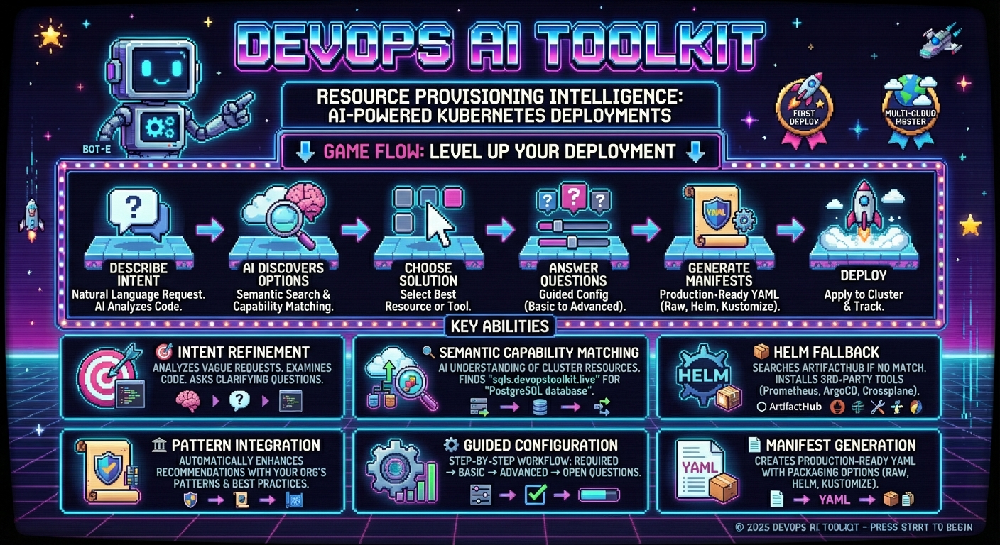

# Recommendation Guide

**Complete guide for using Kubernetes deployment recommendations through MCP (Model Context Protocol).**



## See It In Action

[](https://youtu.be/8Yzn-9qQpQI)

This video explains the platform engineering problem and demonstrates the Kubernetes deployment recommendation workflow from intent to running applications.

## Prerequisites

Before using this guide, complete the [MCP Setup](../setup/mcp-setup.md) to configure your MCP server with:
- DevOps AI Toolkit MCP server running
- AI model API key configured (see [AI Model Configuration](../setup/mcp-setup.md#ai-model-configuration) for supported models and setup)
- `KUBECONFIG` pointing to your Kubernetes cluster (optional but recommended)

**Required - Capability Management:**
- Vector DB service (Qdrant) for capability storage
- Cluster capabilities discovered via [Capability Management Guide](mcp-capability-management-guide.md)
- **Note**: Recommendations will fail without capabilities - the system requires semantic understanding of your cluster resources

**Optional - Enhanced with Organizational Patterns:**
- Organizational patterns created via [Pattern Management Guide](pattern-management-guide.md)
- When configured, recommendations automatically include organizational best practices

## Overview

**What it does**: Provides AI-powered Kubernetes deployment recommendations using cluster capabilities, and installs third-party applications via Helm charts when no matching capability exists. Features semantic capability matching, organizational pattern integration, and guided workflow from intent clarification through deployment.

**Use when**: You need intelligent deployment recommendations that leverage your cluster's actual capabilities, or want to install third-party tools (Prometheus, Argo CD, Crossplane, etc.) via Helm charts with AI-guided configuration.

📖 **Full Guide**: This document covers the complete recommendation workflow with detailed examples and behind-the-scenes explanations.

### Key Features

The DevOps AI Toolkit recommendation feature provides:
- **Intent refinement guidance** - When intent is vague, provides guidance for the client agent (Claude Code, Cursor, etc.) to analyze the project and gather details before proceeding
- **Semantic capability understanding** - Uses discovered resource capabilities for intelligent semantic matching
- **AI-powered recommendations** - Suggests optimal deployment approaches based on capability-filtered resources with rich context
- **Enhanced resource discovery** - Finds resources like `sqls.devopstoolkit.live` for "PostgreSQL database" requests through semantic search
- **Organizational pattern integration** - Automatically enhances recommendations with your team's best practices and standards
- **Guided configuration** - Step-by-step configuration collection for your deployments
- **Manifest generation** - Creates ready-to-deploy Kubernetes YAML files
- **Helm chart installation** - Discovers and installs third-party applications via ArtifactHub when no cluster capability matches
- **Automated deployment** - Deploys and monitors your applications

### How Capability-Enhanced Recommendations Work

**Traditional Problem**: AI sees `sqls.devopstoolkit.live` as a meaningless name among many cluster resources.

**Capability Solution**: AI understands that `sqls.devopstoolkit.live` provides PostgreSQL database capabilities with multi-cloud support.

**Recommendation Flow**:
1. **User Intent**: "I need a PostgreSQL database"
2. **Capability Search**: Semantic search finds relevant resources with capability context
3. **Pre-filtered Results**: AI gets semantically relevant resources instead of all generic resource names
4. **Enhanced Recommendations**: Optimal matches like `sqls.devopstoolkit.live` appear as top suggestions

**Helm Fallback**: When no cluster capability matches (e.g., "Install Prometheus" but no Prometheus operator installed), the system automatically searches ArtifactHub for Helm charts and presents installation options.

## Complete Workflow Examples

### Example 1: Stateless Golang Web Application

```md
User: I want to deploy my app
```

```md
Agent: [Uses mcp__dot-ai__recommend with intent "deploy my app"]

The intent needs more detail. Let me analyze your project to understand what you're deploying.

[Agent analyzes the project directory, reads package.json, Dockerfile, source code, etc.]

Based on my analysis of your project:
- **Language**: Go (found go.mod, main.go)
- **Type**: Web application (HTTP server on port 8080)
- **Dependencies**: Connects to PostgreSQL database (found database connection code)
- **Container**: Ready to containerize (Dockerfile present)

Is this for production or development? And should the app be publicly accessible?
```

```md
User: It's for production, needs external access, expects moderate traffic with occasional spikes.
```

```md
Agent: Perfect! Based on my analysis and your requirements, let me get production-focused deployment recommendations.

[Uses mcp__dot-ai__recommend with refined intent "deploy stateless Golang web application for production with external access via ingress, moderate traffic with occasional spikes requiring autoscaling, connects to PostgreSQL database, container image available" and final: true]

I found 5 deployment solutions for your Golang web application. All include:
- Deployment - manages your stateless app with rolling updates
- Service - internal load balancing and service discovery
- Ingress - external HTTP/HTTPS access
- HorizontalPodAutoscaler - handles traffic spikes

The difference is how PostgreSQL is provisioned:

| #   | Solution                  | Database Approach                                  | Score |
|-----|---------------------------|----------------------------------------------------|-------|
| 1   | Multi-cloud (Recommended) | DevOps Toolkit SQL - portable across AWS/GCP/Azure | 96    |
| 2   | Azure-native              | Azure Flexible Server + ResourceGroup              | 92    |
| 3   | AWS-native                | RDS DBInstance                                     | 90    |
| 4   | GCP-native                | Cloud SQL DatabaseInstance + Database              | 88    |
| 5   | UpCloud                   | ManagedDatabasePostgreSQL                          | 85    |

Organizational Context:
- Solutions 1 & 2 follow your organization's patterns (DevOps Toolkit DB pattern, Azure ResourceGroup pattern)
- Policy enforced: Applications must never use the latest image tag
- Database regions are standardized (us-east-1 for AWS, us-east1 for GCP, eastus for Azure)

Which solution would you like to proceed with? (1-5)
```

**What happened behind the scenes:**
- First call with vague intent ("deploy my app" - under 100 characters) triggered intent refinement guidance
- Agent received guidance to analyze the project and gather details before proceeding
- Agent used its local tools (file reading, code analysis) to discover: Go language, web app type, PostgreSQL dependency, Dockerfile
- Agent discussed findings with user and gathered missing context (production, external access, traffic pattern)
- Second call with detailed intent + `final: true` proceeded to recommendations
- Capability search found relevant resources: Deployment, Service, Ingress, HorizontalPodAutoscaler, plus database operators
- Vector DB search found matching organizational patterns: DevOps Toolkit DB pattern, Azure ResourceGroup pattern
- Generated 5 solution alternatives with different cloud provider options, scoring based on capability relevance and pattern alignment
- Policy intents automatically enforced (e.g., no `latest` image tags, standardized regions)

**Note:** Requires capability scanning via [Capability Management Guide](mcp-capability-management-guide.md) and optionally organizational patterns via [Pattern Management](pattern-management-guide.md). Policy requirements shown require active policy intents created via [Policy Management Guide](policy-management-guide.md).

```md
User: I'll go with option 1
```

```md
Agent: Excellent choice! Let me get the configuration requirements.

[Uses mcp__dot-ai__recommend with stage: 'chooseSolution', solutionId: 'sol-1765409923079-fa3f055c']

I need some required configuration details:

**Application:**
- Name - What should the app be called? (e.g., my-golang-app)
- Namespace - Where to deploy? Options: a-team, b-team, default, dot-ai
- Container image - Full image URI with version tag (e.g., myregistry.io/app:v1.0.0) - latest tag is not allowed per policy
- Port - What port does your app listen on? (default: 8080)
- Ingress hostname - Public DNS name (e.g., myapp.example.com)

**Database:**
- Cloud provider - aws, azure, or gcp?
- Size - small, medium, or large?
- PostgreSQL version - e.g., 15, 14.8

**Output:**
- Format - raw YAML, helm chart, or kustomize?
- Output path - Where to save files? (e.g., ./manifests)

You can answer all at once or just the ones you want to customize (I'll use sensible defaults for the rest).
```

**What happened behind the scenes:**
- recommend tool with stage 'chooseSolution' loaded the selected solution and returned only the required stage questions
- Questions generated from resource schema analysis: Deployment needs name/image/port, Ingress needs hostname, database needs provider/size/version
- Policy intents enforced: "latest" image tag not allowed (flagged in question)
- New packaging questions added: `outputFormat` (raw/helm/kustomize) and `outputPath` for GitOps-ready output
- System categorizes questions as required (must answer) to proceed

```md
User: my-app, a-team namespace, ghcr.io/vfarcic/silly-demo:v1.5.223, port 8080, silly-demo.acme.com for ingress. AWS provider, small database, PostgreSQL 15. Output as Kustomize to ./manifests.
```

```md
Agent: Perfect! Let me configure the required settings.

[Uses mcp__dot-ai__recommend with stage: 'answerQuestion:required', solutionId, answers: {name: "my-app", namespace: "a-team", container-image: "ghcr.io/vfarcic/silly-demo:v1.5.223", application-port: 8080, ingress-host: "silly-demo.acme.com", database-cloud-provider: "aws", database-size: "small", database-version: "15.0", outputFormat: "kustomize", outputPath: "./manifests"}]

Required configuration saved. Now for basic settings (all optional - I can use defaults):

**Scaling:**
- Initial replicas: 2
- Min replicas (HPA): 2
- Max replicas (HPA): 10

**Resources per pod:**
- CPU: 250m request / 500m limit
- Memory: 256Mi request / 512Mi limit

**Networking:**
- Ingress class: nginx
- Enable TLS/HTTPS: yes

**Database:**
- Database name: appdb

Would you like to customize any of these, or should I proceed with these defaults? (say "skip" to use defaults)
```

**What happened behind the scenes:**
- recommend tool with stage 'answerQuestion:required' processed required stage answers and updated solution file
- Validated all required fields were provided (name, namespace, image, port, ingress host, database config)
- Captured output format (Kustomize) and path (./manifests) for later manifest generation
- Determined next stage is 'basic' and returned basic configuration questions with sensible defaults
- Questions are optional at this stage - user can answer, customize specific values, or skip to use defaults

```md
User: 2 replicas, DB name: mydb
```

```md
Agent: Basic settings saved. Now for advanced configuration (all optional):

[Uses mcp__dot-ai__recommend with stage: 'answerQuestion:basic', solutionId, answers: {replicas: 2, hpa-min-replicas: 2, hpa-max-replicas: 10, cpu-request: "250m", cpu-limit: "500m", memory-request: "256Mi", memory-limit: "512Mi", ingress-class: "nginx", database-name: "mydb", enable-tls: true}]

**Deployment Strategy:**
- RollingUpdate with max surge 1, max unavailable 0 (zero-downtime)

**Health Probes:**
- Readiness: /health, 10s initial delay, 10s period
- Liveness: /health, 30s initial delay, 15s period

**Autoscaling:**
- Target CPU: 75%
- Target memory: 75%

**Resilience:**
- PodDisruptionBudget: min 1 available
- Termination grace period: 30s
- Pod anti-affinity: spread across nodes

**Security:**
- Run as non-root: yes
- Read-only filesystem: no
- TLS secret name: app-tls-cert

**Database:**
- Backups enabled: yes

Would you like to customize any of these, or say "skip" to use defaults?
```

**What happened behind the scenes:**
- recommend tool with stage 'answerQuestion:basic' processed basic stage answers (replicas: 2, database-name: mydb, plus defaults)
- Updated solution file and determined next stage is 'advanced'
- Returned advanced configuration questions focused on deployment strategy, health probes, autoscaling, resilience, and security

```md
User: Skip advanced configuration
```

```md
Agent: No problem! Moving to the final configuration stage.

[Uses mcp__dot-ai__recommend with stage: 'answerQuestion:advanced', solutionId, answers: {}]

Any additional requirements or constraints for your deployment?
```

**What happened behind the scenes:**
- recommend tool with stage 'answerQuestion:advanced' processed empty advanced stage answers (using defaults for all)
- Determined next stage is 'open' and returned the open-ended question

```md
User: N/A
```

```md
Agent: Perfect! Configuration complete.

[Uses mcp__dot-ai__recommend with stage: 'answerQuestion:open', solutionId, answers: {open: "N/A"}]

Configuration complete. Ready to generate deployment manifests.
```

**What happened behind the scenes:**
- recommend tool with stage 'answerQuestion:open' processed open stage with "N/A" (no additional requirements)
- All configuration stages now complete (required ✓, basic ✓, advanced defaults, open ✓)
- Returned status: 'ready_for_manifest_generation', nextAction: 'generateManifests'

```md
User: Generate the manifests
```

```md
Agent: Configuration complete. Generating your Kustomize manifests...

[Uses mcp__dot-ai__recommend with stage: 'generateManifests', solutionId]

Your Kustomize manifests are ready at ./manifests/:

manifests/
├── kustomization.yaml              # Points to overlays/production
├── README.md
├── overlays/
│   └── production/
│       └── kustomization.yaml      # ← Edit this file to customize
└── base/
    ├── kustomization.yaml
    ├── namespace.yaml
    ├── deployment.yaml             # Image without tag (tag set in overlay)
    ├── service.yaml
    ├── ingress.yaml
    ├── hpa.yaml
    ├── pdb.yaml
    ├── sql.yaml
    └── secret.yaml

**What's included:**
- **Deployment** - 2 replicas, rolling updates, pod anti-affinity, non-root security
- **Service** - ClusterIP on port 80
- **Ingress** - silly-demo.acme.com with TLS via cert-manager
- **HPA** - scales 2-10 replicas based on CPU/memory (75% threshold)
- **PDB** - ensures at least 1 pod available during disruptions
- **SQL** - AWS PostgreSQL 15 (small) via DevOps Toolkit pattern
- **Secret** - database credentials (placeholder - will be populated by Crossplane)

**To customize:**
Edit `overlays/production/kustomization.yaml`:
- `image:` section to change image tag (for upgrades)
- `patches:` for other customizations

Deploy with:
kubectl apply -k ./manifests

Would you like me to deploy this to your cluster now?
```

**What happened behind the scenes:**
- recommend tool with stage 'generateManifests' loaded the fully configured solution file
- AI generated Kustomize structure based on `outputFormat: kustomize` selection
- Raw manifests generated first, validated via `kubectl kustomize | kubectl apply --dry-run=server`
- AI packaged validated manifests into Kustomize structure:
  - `base/` contains generic manifests (image without tag)
  - `overlays/production/kustomization.yaml` sets image tag and customizations
- Response includes `files` array with `relativePath` and `content` for each file
- Agent writes files to user's chosen `outputPath` (./manifests)
- Each resource includes dot-ai.io/ labels for tracking
- README.md generated with deployment instructions and overlay examples

```md
User: Yes, deploy it!
```

```md
Agent: Deploying your application...

[Uses mcp__dot-ai__recommend with stage: 'deployManifests', solutionId]

🎉 **Deployed successfully!** All resources were created:

- namespace/a-team configured
- deployment.apps/my-app created
- service/my-app created
- ingress.networking.k8s.io/my-app created
- horizontalpodautoscaler.autoscaling/my-app created
- poddisruptionbudget.policy/my-app created
- sql.devopstoolkit.live/my-app-db created
- secret/my-app-db-credentials created

**Next steps:**
1. Wait for the SQL resource to provision the AWS RDS PostgreSQL instance (may take 5-10 minutes)
2. Once RDS is ready, Crossplane will populate the actual database credentials
3. The app will become healthy once it can connect to the database
4. Access your app at https://silly-demo.acme.com (ensure DNS points to your ingress controller)

**Verify status:**
kubectl get all -n a-team
kubectl get sql -n a-team
kubectl get ingress -n a-team
```

**What happened behind the scenes:**
- recommend tool with stage 'deployManifests' applied Kustomize manifests using `kubectl apply -k`
- Created all resources: Namespace, Deployment, Service, Ingress, HPA, PDB, SQL (database), Secret
- SQL resource triggers Crossplane to provision AWS RDS PostgreSQL instance
- Provided next steps and verification commands

### Example 2: Third-Party Application Installation (Helm)

This example demonstrates installing third-party tools via Helm charts when no matching cluster capability exists.

```md
User: Install Prometheus
```

```md
Agent: [Uses mcp__dot-ai__recommend with intent "install Prometheus monitoring" and final: true]

Found a Prometheus Helm chart solution:

**prometheus-community/prometheus (v27.49.0)**
- App Version: v3.8.0
- Official chart maintained by prometheus-community
- Verified Publisher with 523 stars
- Repository: https://prometheus-community.github.io/helm-charts

This is the standard, recommended chart for installing Prometheus monitoring on Kubernetes.

Would you like me to proceed with this chart? I'll guide you through the configuration options.
```

**What happened behind the scenes:**
- System detected "Install Prometheus" as a third-party installation intent
- No Prometheus-related CRDs found in cluster capabilities, triggering Helm chart discovery
- ArtifactHub API searched for "prometheus" charts
- AI analyzed and scored charts based on official status, verified publisher, and popularity

```md
User: Yes, continue
```

```md
Agent: [Uses mcp__dot-ai__recommend with stage: 'chooseSolution', solutionId]

I need some details to configure your Prometheus installation:

**Required Configuration:**
- What name should be used for this Prometheus deployment?
- Which namespace should Prometheus be deployed to?
- Should Prometheus use persistent storage for metrics data?
```

**What happened behind the scenes:**
- System fetched chart values.yaml and README via Helm CLI
- AI analyzed configuration options and categorized into required/basic/advanced questions
- Cluster context gathered: available namespaces, StorageClasses
- Questions include suggested answers based on chart defaults and cluster state

```md
User: prometheus, monitoring namespace, no persistence
```

```md
Agent: [Uses mcp__dot-ai__recommend with stage: 'answerQuestion:required', solutionId, answers]

Here are some basic configuration options. Would you like to customize these or use defaults?

**Key settings (defaults shown):**
- Data retention: 15 days
- Scrape interval: 1 minute
- AlertManager: enabled
- kube-state-metrics: enabled (cluster object metrics)
- node-exporter: enabled (node hardware metrics)
- PushGateway: disabled
- Ingress: disabled
```

```md
User: Enable AlertManager
```

```md
Agent: [Uses mcp__dot-ai__recommend with stage: 'answerQuestion:basic', solutionId, answers]

Basic configuration set. Now for advanced options.

[Uses mcp__dot-ai__recommend with stage: 'answerQuestion:advanced', solutionId, answers: {}]

Skipping advanced options. Ready to generate the installation.

[Uses mcp__dot-ai__recommend with stage: 'generateManifests', solutionId]

Helm installation ready. Here's the configuration:

**Helm Command:**
helm upgrade --install prometheus prometheus-community/prometheus \
  --namespace monitoring --create-namespace \
  --version 27.49.0 -f values.yaml

**Values (values.yaml):**
server:
  global:
    scrape_interval: 1m
    scrape_timeout: 10s
    evaluation_interval: 1m
  retention: 15d
  persistentVolume:
    enabled: false

alertmanager:
  enabled: true

kube-state-metrics:
  enabled: true

prometheus-node-exporter:
  enabled: true

prometheus-pushgateway:
  enabled: false

Ready to install?
```

**What happened behind the scenes:**
- AI generated values.yaml containing only non-default values
- System ran `helm upgrade --install --dry-run` to validate the installation
- Returned helm command and values for user review

```md
User: Yes, deploy
```

```md
Agent: [Uses mcp__dot-ai__recommend with stage: 'deployManifests', solutionId]

Prometheus deployed successfully to the monitoring namespace.

**Deployed Components:**
- Prometheus Server
- AlertManager
- kube-state-metrics
- node-exporter

**Access Prometheus UI:**
kubectl --namespace monitoring port-forward svc/prometheus-server 9090:80
Then open http://localhost:9090

**Access AlertManager:**
kubectl --namespace monitoring port-forward svc/prometheus-alertmanager 9093:9093
Then open http://localhost:9093

**Internal DNS names:**
- Prometheus: prometheus-server.monitoring.svc.cluster.local:80
- AlertManager: prometheus-alertmanager.monitoring.svc.cluster.local:9093
```

**What happened behind the scenes:**
- Helm repository added and `helm upgrade --install --wait` executed
- Helm waited for all pods to become ready before reporting success
- Access instructions provided based on installed components

## See Also

- **[MCP Setup Guide](../setup/mcp-setup.md)** - Initial MCP server configuration
- **[Tools and Features Overview](mcp-tools-overview.md)** - Browse all available tools and features