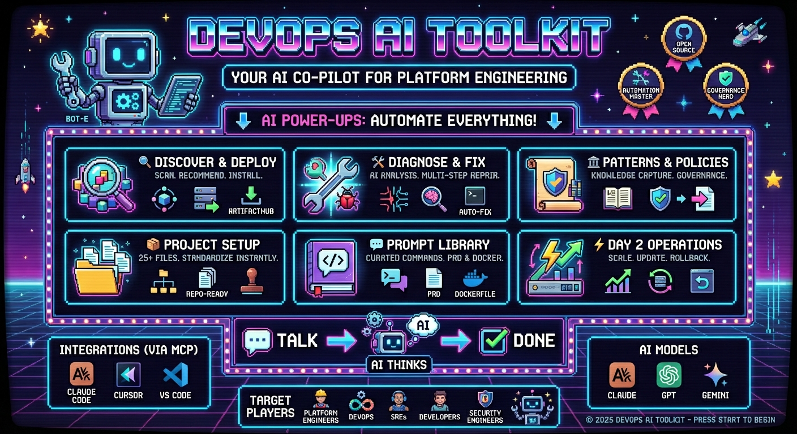

# DevOps AI Toolkit

**AI-powered platform engineering and DevOps automation through intelligent Kubernetes operations and conversational workflows.**

---

## What is DevOps AI Toolkit?

DevOps AI Toolkit brings AI-powered intelligence to platform engineering, Kubernetes operations, and development workflows. It provides intelligent Kubernetes deployment recommendations through capability discovery and semantic matching, AI-powered issue remediation, automated repository setup with governance and security files, and shared prompt libraries for consistent development workflows—all through natural language conversation.

Built on the Model Context Protocol (MCP), it integrates seamlessly with Claude Code, Cursor, and VS Code to provide conversational interaction for complex DevOps and development tasks.

## Mission

DevOps AI Toolkit democratizes platform engineering and cloud native operations by making complex workflows accessible through AI-powered automation. We eliminate the expertise barrier that prevents teams from adopting best practices in Kubernetes operations, repository governance, and standardized development workflows—making professional-grade DevOps accessible through natural language interaction.

## Who Should Use This?

**DevOps AI Toolkit is for teams who want to**:
- Manage cloud resources (AWS, Azure, GCP) using Kubernetes as a control plane (developers, platform engineers)
- Quickly diagnose and fix cluster and infrastructure issues (SREs, DevOps engineers)
- Standardize resource provisioning with organizational patterns and policies (security engineers, platform teams)
- Bootstrap repositories with governance and security files (project maintainers)
- Access curated development prompts through native slash commands (development teams)

## Scope

### In Scope
- AI-powered resource provisioning recommendations using Kubernetes as control plane
- Intelligent issue remediation and root cause analysis
- Organizational pattern and policy management with semantic search
- MCP-based integration with AI coding assistants
- Multi-provider AI model support (Claude, GPT, Gemini)
- Project setup with governance, legal, and security files

### Out of Scope
- Kubernetes cluster provisioning/management (delegates to existing tools)
- CI/CD pipeline execution (provides recommendations only)
- Application runtime monitoring (integrates with existing observability tools)

## Key Features

### Resource Provisioning Intelligence
Automatically discovers cluster resources using semantic capability management. AI understands what each resource actually does, providing intelligent recommendations for provisioning resources across clouds using Kubernetes as a control plane. When no matching capability exists, automatically discovers and installs third-party tools (Prometheus, Argo CD, Crossplane, etc.) via Helm charts from ArtifactHub.

[Deployment Guide](guides/mcp-recommendation-guide.md) | [Capability Management](guides/mcp-capability-management-guide.md)

### Issue Remediation
AI-powered root cause analysis with multi-step investigation, executable remediation commands, and safety mechanisms for manual or automatic execution.

[Learn more](guides/mcp-remediate-guide.md)

### Pattern & Policy Management
Capture organizational knowledge and governance policies that automatically enhance AI recommendations with best practices and compliance requirements. Uses vector search for intelligent semantic matching.

[Pattern Management](guides/pattern-management-guide.md) | [Policy Management](guides/policy-management-guide.md)

### Project Setup & Governance
Generate 25+ governance, legal, and automation files (LICENSE, CODE_OF_CONDUCT, CONTRIBUTING, SECURITY, GitHub workflows, Renovate, OpenSSF Scorecard) for repository standardization.

[Learn more](guides/mcp-project-setup-guide.md)

### Shared Prompts Library
Access curated prompts as native slash commands (`/dot-ai:prompt-name`) in your coding agent for consistent workflows across projects:
- **PRD Management**: Create, track, and complete Product Requirements Documents (`prd-create`, `prd-next`, `prd-done`, etc.)
- **Dockerfile Generation**: Generate production-ready, secure multi-stage Dockerfiles for any project (`generate-dockerfile`)
- **CI/CD Generation**: Generate intelligent CI/CD workflows through interactive conversation (`generate-cicd`)

[Learn more](guides/mcp-prompts-guide.md)

### AI Integration
Works with Claude Code, Cursor, VS Code via Model Context Protocol. Supports multiple AI providers (Claude, GPT, Gemini, Host LLM) for flexibility and cost optimization.

[AI Model Configuration](setup/mcp-setup.md#ai-model-configuration)

## Quick Start

Get started in 3 steps:
1. Configure MCP server (Docker or npm)
2. Connect your AI coding assistant (Claude Code, Cursor, VS Code)
3. Start using conversational workflows

[Quick Start Guide](quick-start.md)

## Documentation

### Getting Started
- **[Quick Start Guide](quick-start.md)** - Get started in minutes
- **[MCP Setup Guide](setup/mcp-setup.md)** - Complete configuration instructions
- **[Tools Overview](guides/mcp-tools-overview.md)** - All available tools and features

### Deployment Options
- **[Docker Setup](setup/docker-setup.md)** - Recommended for local development
- **[Kubernetes Setup](setup/kubernetes-setup.md)** - Production deployment with Ingress
- **[ToolHive Setup](setup/kubernetes-toolhive-setup.md)** - Operator-managed deployment
- **[NPX Setup](setup/npx-setup.md)** - Quick trials with Node.js

### Feature Guides
- **[Resource Provisioning](guides/mcp-recommendation-guide.md)** - AI-powered deployment recommendations
- **[Capability Management](guides/mcp-capability-management-guide.md)** - Semantic resource discovery
- **[Issue Remediation](guides/mcp-remediate-guide.md)** - AI-powered troubleshooting
- **[Pattern Management](guides/pattern-management-guide.md)** - Organizational deployment patterns
- **[Policy Management](guides/policy-management-guide.md)** - Governance and compliance
- **[Project Setup](guides/mcp-project-setup-guide.md)** - Repository governance automation
