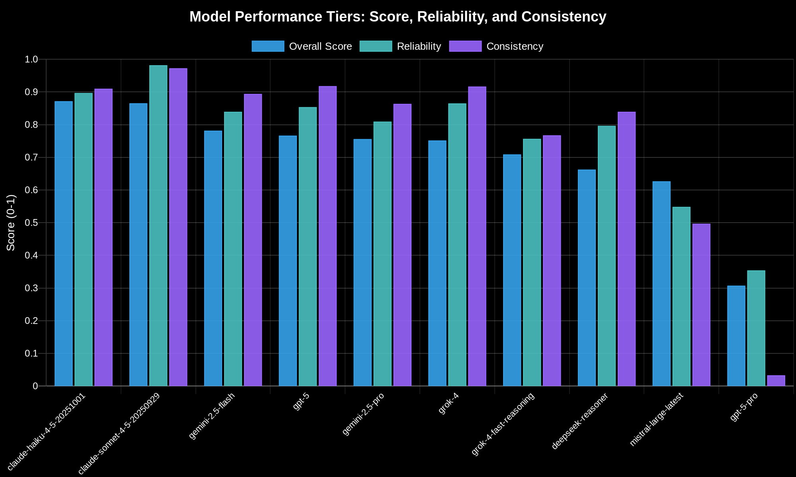
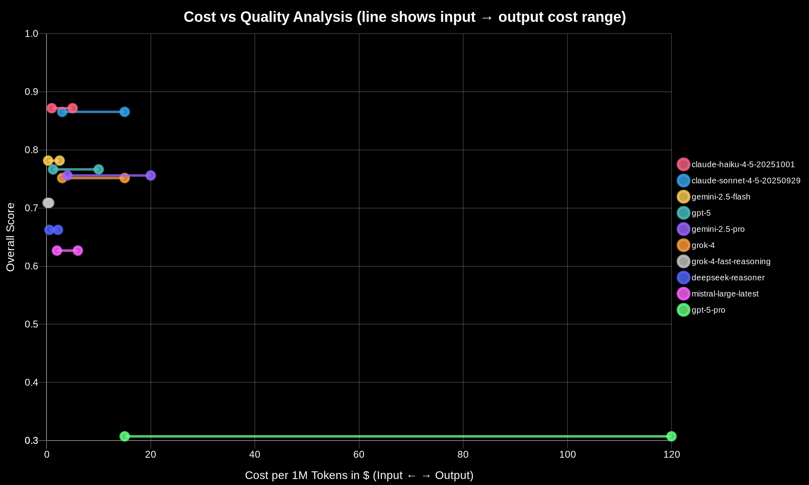
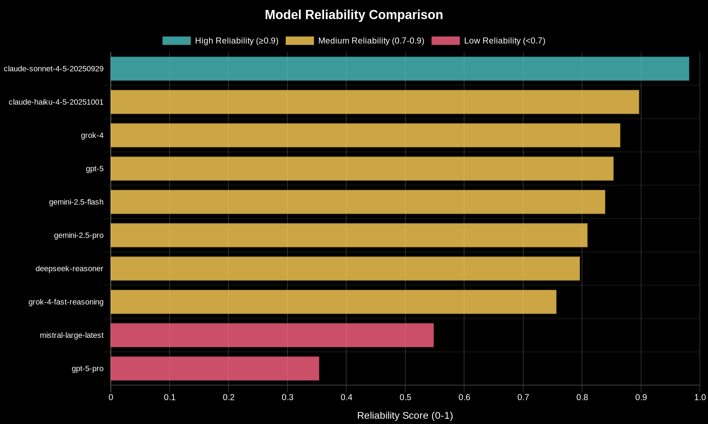
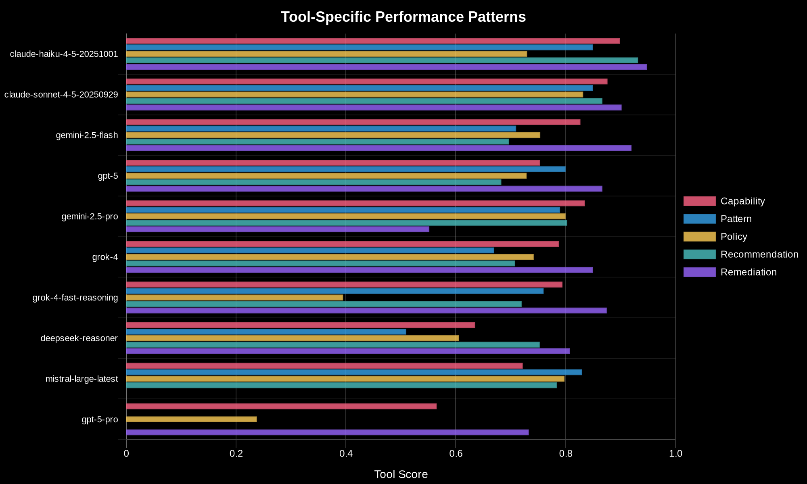
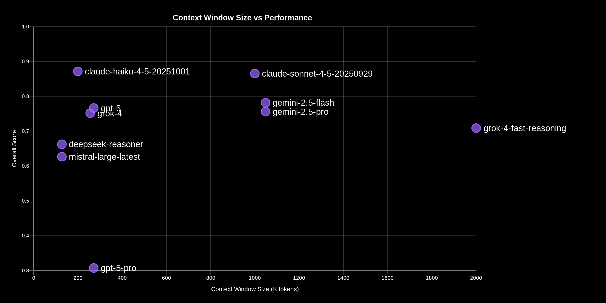

# Platform-Wide AI Model Analysis Report

Generated: 2024-01-09

## Executive Summary

This report analyzes 10 AI models across 5 types of AI agent interactions to provide comprehensive platform-wide insights and recommendations. The evaluation reveals clear performance tiers, with Anthropic's Claude models dominating across nearly all categories, while budget options like Grok-4-Fast-Reasoning and Gemini-2.5-Flash offer compelling value propositions. Critical reliability issues were identified in GPT-5-Pro and Mistral-Large-Latest, making them unsuitable for production use.

## Evaluation Scenarios

### Tool Summaries

- **Capability Analysis**: Tests a model's endurance and consistency by requiring ~100 consecutive AI interactions within 45 minutes to discover and analyze all Kubernetes cluster resources. Success depends on maintaining quality throughout this marathon session while demonstrating deep Kubernetes knowledge for each resource type.

- **Pattern Recognition**: Evaluates multi-step interactive workflow handling within a tight 5-minute timeout. Models must expand trigger keywords into comprehensive lists, abstract specific requirements into reusable organizational patterns, and create templates that can be stored and searched in a Vector DB.

- **Policy Compliance**: Assesses a model's ability to perform schema-by-schema analysis of cluster resources within 15 minutes, expanding policy triggers into comprehensive resource categories, and generating complete, syntactically correct Kyverno policies with CEL validation expressions.

- **Recommendations**: Tests manifest generation under extreme context pressure, requiring models to process up to 50 large Kubernetes resource schemas (100K+ tokens) within 20 minutes while transforming user intent into production-ready YAML manifests through clarification questions.

- **Remediation**: Evaluates problem-solving capabilities through systematic cluster investigation using multiple kubectl commands within 20-30 minutes. Models must identify root causes from minimal descriptions, generate executable remediation commands with risk assessments, and handle multi-step investigation workflows with 5-8 iterations.

## Key Findings

### 1. Performance Tiers Emerge: Clear Stratification Across Quality Metrics

The evaluation reveals three distinct performance tiers:

**Top Tier (0.85+ overall, 0.89+ reliability, 0.91+ consistency)**:
- **claude-haiku-4-5-20251001**: 0.872 overall, 0.897 reliability, 0.910 consistency - Leads in 4 of 5 tool categories
- **claude-sonnet-4-5-20250929**: 0.865 overall, 0.982 reliability, 0.973 consistency - Highest reliability and consistency scores

These models excel due to superior reliability (completing evaluation sessions without failures) and exceptional cross-tool consistency. Claude-Haiku dominates through raw performance, while Claude-Sonnet achieves near-perfect reliability with 100% participation rate.

**Mid Tier (0.70-0.80 overall, 0.80+ reliability)**:
- **gemini-2.5-flash**: 0.782 overall, 0.839 reliability, 0.894 consistency
- **gpt-5**: 0.766 overall, 0.854 reliability, 0.918 consistency
- **gemini-2.5-pro**: 0.756 overall, 0.809 reliability, 0.864 consistency
- **grok-4**: 0.752 overall, 0.865 reliability, 0.917 consistency

These models offer solid production performance with some tool-specific weaknesses. Gemini-2.5-Flash stands out for its massive 1M+ context window at budget pricing, while GPT-5 and Grok-4 maintain consistent performance patterns despite lower absolute scores.

**Bottom Tier (<0.70 overall or <0.80 reliability)**:
- **grok-4-fast-reasoning**: 0.709 overall, 0.757 reliability, 0.767 consistency - Severe policy compliance failure (0.395)
- **deepseek-reasoner**: 0.662 overall, 0.796 reliability, 0.839 consistency - Weak pattern recognition (0.51)
- **mistral-large-latest**: 0.627 overall, 0.548 reliability, 0.497 consistency - Complete remediation failure (0.0)
- **gpt-5-pro**: 0.307 overall, 0.354 reliability, 0.033 consistency - Catastrophic cross-tool failures

Bottom-tier models suffer from critical reliability issues, with GPT-5-Pro showing complete failure in pattern recognition and recommendations (0.0 scores), while Mistral-Large-Latest couldn't complete remediation workflows at all.

### 2. Value Discovery: Grok-4-Fast-Reasoning Dominates Cost-Performance

**grok-4-fast-reasoning** achieves an exceptional value score of 2.025 - more than 3.6x better than the next competitor. At $0.20 input/$0.50 output per million tokens (total: $0.35/1M tokens average), it delivers 0.709 overall performance at just 40% the cost of Claude-Haiku's $1.00 input/$5.00 output ($3.00/1M average).

**Value Rankings**:
1. **grok-4-fast-reasoning**: 2.025 value score ($0.35/1M tokens, 0.709 performance)
2. **gemini-2.5-flash**: 0.558 value score ($0.30 input/$2.50 output = $1.40/1M average, 0.782 performance)
3. **deepseek-reasoner**: 0.484 value score ($0.55 input/$2.19 output = $1.37/1M average, 0.662 performance)

**Critical Trade-offs**: While Grok-4-Fast-Reasoning offers unmatched value, it has a catastrophic policy compliance score (0.395) - failing the 15-minute schema analysis timeout requirement. This makes it suitable for cost-sensitive remediation and capability analysis work but dangerous for policy generation. Gemini-2.5-Flash provides better-balanced performance at similar cost, with no critical failures.

**Premium vs Budget**: Claude-Haiku ($3.00/1M average) costs 8.6x more than Grok-4-Fast-Reasoning but delivers only 23% higher performance (0.872 vs 0.709). For budget-conscious deployments accepting tool-specific limitations, the value proposition is compelling.

### 3. Production Failures: Critical Reliability Issues in Two Models

**gpt-5-pro** suffers catastrophic failures:
- **Reliability**: 0.354 (lowest among all models)
- **Consistency**: 0.033 (indicates near-complete cross-tool failure)
- **Participation Rate**: 51.6% (failed to complete nearly half of evaluations)
- **Complete Failures**: Pattern recognition (0.0), recommendations (0.0)
- **Root Cause**: Cannot handle multi-step interactive workflows or large context windows (100K+ tokens with 50 schemas) within timeout constraints

**mistral-large-latest** shows severe remediation issues:
- **Reliability**: 0.548 (second-lowest)
- **Consistency**: 0.497 (indicates high variability)
- **Participation Rate**: 65% (failed 35% of evaluations)
- **Complete Failure**: Remediation (0.0) - cannot complete the 20-30 minute investigation workflow with 5-8 iterations
- **Pattern**: Strong on policy (0.798) and pattern (0.83) analysis but completely fails multi-step problem-solving

**Why These Models Fail**: GPT-5-Pro's failures stem from timeout issues - it cannot process the extensive context required for recommendations (50+ large schemas) or complete the multi-phase interactive workflows for pattern creation within 5-20 minute limits. Mistral-Large-Latest specifically fails the endurance test of remediation's systematic cluster investigation, suggesting issues with maintaining state across multiple iterations.

**Production Impact**: These models should be avoided for any production deployment requiring:
- Multi-step interactive workflows (pattern creation, remediation investigation)
- Large context processing (recommendations with 50+ schemas)
- Reliable completion within timeout constraints (all tools)

### 4. Tool-Specific Performance Patterns: Claude Dominates, But Tool Requirements Drive Success

**Tool-by-Tool Leaders**:
- **Capability Analysis** (45-min endurance test): claude-haiku-4-5-20251001 (0.899) - Excels at the ~100 consecutive interactions required for full cluster scanning
- **Pattern Recognition** (5-min workflow): claude-haiku-4-5-20251001 (0.850) - Tied with claude-sonnet-4-5-20250929, both handle rapid trigger expansion effectively
- **Policy Compliance** (15-min schema analysis): claude-sonnet-4-5-20250929 (0.832) - Superior systematic analysis across all cluster resource schemas
- **Recommendations** (20-min with 100K+ context): claude-haiku-4-5-20251001 (0.932) - Best at processing massive schema context for manifest generation
- **Remediation** (20-30 min investigation): claude-haiku-4-5-20251001 (0.948) - Strongest multi-step problem-solving with 5-8 iteration workflows

**Performance Patterns Explained**:

*Context Window Correlation*: Models with larger context windows dominate recommendations - claude-sonnet-4-5-20250929 (1M context) and gemini-2.5-flash (1M context) both score 0.85+ despite Gemini's lower overall performance. The 100K+ token requirement for 50 schemas overwhelms smaller context models.

*Endurance Correlation*: Capability analysis (0.899 for Claude-Haiku vs 0.635 for DeepSeek-Reasoner) reveals which models maintain quality through ~100 consecutive interactions. DeepSeek's 35% lower score directly correlates with its inability to sustain performance through marathon sessions.

*Speed vs Quality Trade-offs*: Grok-4-Fast-Reasoning's name suggests optimization for speed, but its 0.395 policy compliance score reveals it sacrifices thoroughness for speed - it cannot complete the comprehensive schema-by-schema analysis within 15 minutes.

**Specialized vs Universal Performers**: 
- **Universal**: claude-haiku-4-5-20251001 leads in 4/5 categories with no score below 0.73
- **Specialized**: gemini-2.5-flash excels at remediation (0.920, 3rd highest) but struggles with pattern recognition (0.71) and recommendations (0.697)
- **Inconsistent**: grok-4-fast-reasoning ranges from 0.875 (remediation) to 0.395 (policy), showing the widest performance variance

### 5. Context Window Correlation: Massive Context Drives Recommendations Performance

**Context Window Analysis**:
- **Large Context (1M+ tokens)**: claude-sonnet-4-5-20250929 (1M), gemini-2.5-flash (1M), gemini-2.5-pro (1M)
- **Medium Context (256K-272K)**: grok-4 (256K), gpt-5 (272K), gpt-5-pro (272K)
- **Small Context (128K-200K)**: claude-haiku-4-5-20251001 (200K), mistral-large-latest (128K), deepseek-reasoner (128K)
- **Massive Context (2M)**: grok-4-fast-reasoning (2M)

**Recommendations Performance Correlation**:
The recommendations tool requires processing up to 50 large Kubernetes resource schemas (100K+ tokens total) to generate production-ready manifests within 20 minutes.

- **1M+ Context Models**: claude-sonnet (0.867), gemini-2.5-pro (0.803), gemini-2.5-flash (0.697)
- **Medium Context Models**: gpt-5 (0.683), grok-4 (0.708)
- **Small Context Models**: claude-haiku (0.932) ⚠️ OUTLIER, deepseek-reasoner (0.753)

**Critical Finding**: Claude-Haiku's exceptional 0.932 recommendations score despite only 200K context window reveals superior context efficiency - it processes large schema sets more effectively than models with 5x larger windows. This suggests architectural advantages in attention mechanisms or context utilization.

**Why Context Matters**: 
- **Policy Compliance**: Models with smaller contexts struggle with comprehensive schema analysis - deepseek-reasoner (128K context, 0.606 policy score) vs claude-sonnet (1M context, 0.832 policy score)
- **Capability Analysis**: Endurance testing with ~100 consecutive interactions benefits from larger context for maintaining conversation state - grok-4-fast-reasoning (2M context, 0.794 capability) vs mistral-large-latest (128K context, 0.722 capability)

**Exception**: Grok-4-Fast-Reasoning's 2M context window doesn't translate to recommendations success (0.720) due to timeout issues - context size alone doesn't guarantee performance without efficient processing.

## Model Profiles

### claude-haiku-4-5-20251001 - Production Ready (Anthropic)
**Overall Score**: 0.872 | **Reliability**: 0.897 | **Consistency**: 0.910 | **Cost**: $3.00/1M tokens ($1.00 input, $5.00 output)

**Strengths**:
- Dominates 4 of 5 tool categories: capability (0.899), recommendations (0.932), remediation (0.948), pattern (0.850)
- Exceptional at handling large context (100K+ tokens) with only 200K window - demonstrates superior efficiency
- Maintains quality through marathon sessions (~100 consecutive interactions for capability analysis)
- Reliable completion of multi-step workflows within timeout constraints

**Weaknesses**:
- Lowest policy compliance score among top-tier models (0.730 vs 0.832 for Claude-Sonnet)
- 200K context window smaller than competing models (though compensated by efficiency)

**Best Use Cases**: Default choice for all production workloads, especially recommendations and remediation requiring systematic investigation, complex manifest generation, and multi-iteration problem-solving

**Avoid For**: Policy generation workflows where Claude-Sonnet's superior schema analysis (0.832) provides better results

---

### claude-sonnet-4-5-20250929 - Production Ready (Anthropic)
**Overall Score**: 0.865 | **Reliability**: 0.982 | **Consistency**: 0.973 | **Cost**: $9.00/1M tokens ($3.00 input, $15.00 output)

**Strengths**:
- Highest reliability (0.982) and consistency (0.973) scores - most dependable model
- Perfect participation rate (100%) - never fails to complete evaluations
- Best policy compliance (0.832) for comprehensive schema-by-schema analysis
- Massive 1M context window enables handling of extremely large schema sets

**Weaknesses**:
- 3x more expensive than Claude-Haiku ($9.00 vs $3.00 per 1M tokens)
- Slightly lower recommendations (0.867) and remediation (0.902) scores than Claude-Haiku

**Best Use Cases**: Mission-critical production deployments requiring maximum reliability, policy generation workflows, environments where failures are unacceptable

**Avoid For**: Cost-sensitive deployments where Claude-Haiku provides 97% of the performance at 33% of the cost

---

### gemini-2.5-flash - Cost-Optimized (Google)
**Overall Score**: 0.782 | **Reliability**: 0.839 | **Consistency**: 0.894 | **Cost**: $1.40/1M tokens ($0.30 input, $2.50 output)

**Strengths**:
- Excellent value at $1.40/1M tokens - 2.1x cheaper than Claude-Haiku with 90% of the performance
- Massive 1M+ context window at budget pricing
- Strong remediation performance (0.920, 3rd overall)
- Solid reliability (0.839) with 93.4% participation rate

**Weaknesses**:
- Weak pattern recognition (0.71) - struggles with trigger expansion and abstraction
- Below-average recommendations (0.697) despite large context window
- Inconsistent across tools - strong in some areas, weak in others

**Best Use Cases**: Budget-conscious production deployments, remediation workflows, capability analysis where cost efficiency matters more than absolute top performance

**Avoid For**: Pattern creation workflows and complex manifest generation where mid-tier scores create risk

---

### gpt-5 - Production Ready (OpenAI)
**Overall Score**: 0.766 | **Reliability**: 0.854 | **Consistency**: 0.918 | **Cost**: $5.63/1M tokens ($1.25 input, $10.00 output)

**Strengths**:
- Excellent consistency (0.918) - predictable performance across tools
- Strong pattern recognition (0.800) - best among non-Claude models
- Solid remediation (0.867) and reliability (0.854)
- 272K context window handles most use cases

**Weaknesses**:
- Higher cost ($5.63/1M) than comparable performers like Gemini-2.5-Flash ($1.40/1M)
- Below-average recommendations (0.683) - struggles with large schema processing
- Mid-tier scores across most categories without standout strengths

**Best Use Cases**: Pattern creation workflows, organizations already invested in OpenAI ecosystem, workloads requiring consistent mid-tier performance

**Avoid For**: Cost-sensitive deployments (Gemini-2.5-Flash offers better value) or scenarios requiring top-tier recommendations performance

---

### gemini-2.5-pro - Production Ready (Google)
**Overall Score**: 0.756 | **Reliability**: 0.809 | **Consistency**: 0.864 | **Cost**: $12.00/1M tokens ($4.00 input, $20.00 output)

**Strengths**:
- Strong capability analysis (0.835) - handles endurance testing well
- Solid policy compliance (0.800) for schema analysis
- Large 1M+ context window
- Balanced performance across most tools

**Weaknesses**:
- Catastrophic remediation failure (0.552) - cannot complete multi-step investigation workflows reliably
- Most expensive model tested ($12.00/1M tokens)
- Lower reliability (0.809) and participation (88.4%) than competitors
- Poor value proposition - costs 4x more than Claude-Haiku but performs 13% worse

**Best Use Cases**: Capability analysis and policy generation in Google Cloud environments where ecosystem integration matters

**Avoid For**: Remediation workflows (0.552 score is production-risky), cost-sensitive deployments, scenarios where Claude-Haiku offers superior performance at 25% of the cost

---

### grok-4 - Production Ready (xAI)
**Overall Score**: 0.752 | **Reliability**: 0.865 | **Consistency**: 0.917 | **Cost**: $9.00/1M tokens ($3.00 input, $15.00 output)

**Strengths**:
- Strong remediation (0.850) - handles multi-step investigation effectively
- Excellent consistency (0.917) - predictable cross-tool performance
- Good reliability (0.865) with 95% participation rate
- Solid capability analysis (0.788)

**Weaknesses**:
- Weak pattern recognition (0.670) - struggles with trigger expansion workflows
- Below-average policy compliance (0.742) for schema analysis
- Premium pricing ($9.00/1M) same as Claude-Sonnet but with 13% lower performance
- 256K context window smaller than competing premium models

**Best Use Cases**: Remediation workflows in xAI ecosystem deployments, scenarios requiring consistent mid-tier performance with good reliability

**Avoid For**: Pattern creation (0.670 is borderline), policy generation, cost-sensitive deployments where Gemini-2.5-Flash offers better value

---

### grok-4-fast-reasoning - Cost-Optimized (xAI)
**Overall Score**: 0.709 | **Reliability**: 0.757 | **Consistency**: 0.767 | **Cost**: $0.35/1M tokens ($0.20 input, $0.50 output)

**Strengths**:
- Exceptional value score (2.025) - best cost-performance ratio by 3.6x
- Lowest cost in evaluation ($0.35/1M tokens)
- Massive 2M context window
- Strong remediation (0.875) and capability (0.794) performance at budget pricing

**Weaknesses**:
- **CRITICAL**: Catastrophic policy compliance failure (0.395) - cannot complete 15-minute schema analysis
- Lowest consistency (0.767) - unpredictable tool-to-tool performance
- Poor reliability (0.757) with 90% participation rate
- Recommendation struggles (0.720) despite massive context window

**Best Use Cases**: Budget-constrained remediation workflows, capability analysis for cost-sensitive environments, development/testing where failures are acceptable

**Avoid For**: **Policy generation (0.395 is production-dangerous)**, mission-critical deployments, any scenario requiring reliable completion within timeout constraints

---

### deepseek-reasoner - Cost-Optimized (DeepSeek)
**Overall Score**: 0.662 | **Reliability**: 0.796 | **Consistency**: 0.839 | **Cost**: $1.37/1M tokens ($0.55 input, $2.19 output)

**Strengths**:
- Good value at $1.37/1M tokens
- Solid remediation (0.808) and recommendations (0.753) for budget tier
- Decent consistency (0.839) for cross-tool performance
- **Does not support function calling** - architectural difference from competitors

**Weaknesses**:
- Weak pattern recognition (0.510) - worst score among evaluated models for this tool
- Poor capability analysis (0.635) - struggles with endurance testing (~100 interactions)
- Small 128K context window limits large schema processing
- Lower participation rate (85%) indicates timeout issues

**Best Use Cases**: Budget remediation and recommendations workflows where function calling isn't required, development environments

**Avoid For**: Pattern creation (0.510 is inadequate), capability analysis requiring sustained quality, production deployments needing function calling support

---

### mistral-large-latest - Avoid for Production (Mistral)
**Overall Score**: 0.627 | **Reliability**: 0.548 | **Consistency**: 0.497 | **Cost**: $4.00/1M tokens ($2.00 input, $6.00 output)

**Strengths**:
- Strong pattern recognition (0.830) - best among non-Claude models
- Solid policy compliance (0.798) for schema analysis
- Good capability analysis (0.722)

**Weaknesses**:
- **CRITICAL**: Complete remediation failure (0.0) - cannot handle multi-step investigation workflows
- Extremely poor reliability (0.548) and consistency (0.497) - second-worst in evaluation
- Low participation rate (65%) - fails 35% of evaluations
- Mid-tier pricing ($4.00/1M) without corresponding performance

**Best Use Cases**: Pattern creation workflows only - if remediation isn't required

**Avoid For**: **Any production deployment requiring remediation**, mission-critical workloads, scenarios where reliability matters (65% participation rate is unacceptable)

---

### gpt-5-pro - Avoid for Production (OpenAI)
**Overall Score**: 0.307 | **Reliability**: 0.354 | **Consistency**: 0.033 | **Cost**: $67.50/1M tokens ($15.00 input, $120.00 output)

**Strengths**:
- None identified - performance doesn't justify inclusion in production recommendations

**Weaknesses**:
- **CRITICAL**: Catastrophic cross-tool failures - pattern (0.0), recommendations (0.0)
- Lowest consistency (0.033) in evaluation - completely unpredictable
- Worst reliability (0.354) with only 51.6% participation rate
- Most expensive model ($67.50/1M tokens) while delivering worst performance
- Cannot handle multi-step workflows or large context processing within timeout constraints

**Best Use Cases**: None - should not be used in production

**Avoid For**: **All production deployments** - reliability and consistency scores indicate fundamental architectural issues preventing reliable completion of AI agent workflows

## Production Recommendations

### Quality-First Priority
- **Primary Model**: claude-haiku-4-5-20251001
- **Fallback Model**: claude-sonnet-4-5-20250929
- **Reasoning**: Claude-Haiku delivers the highest overall performance (0.872) with excellent reliability (0.897) and leads in 4 of 5 tool categories. Its exceptional efficiency at processing large contexts despite a smaller 200K window makes it ideal for recommendations and remediation. Claude-Sonnet provides the ultimate fallback with the highest reliability (0.982) and consistency (0.973) scores in the evaluation, ensuring mission-critical workloads always complete successfully.
- **Cost**: $3.00/1M tokens (primary), $9.00/1M tokens (fallback)
- **Use Cases**: Production deployments prioritizing accuracy and completeness, complex troubleshooting requiring multi-step investigation, sophisticated manifest generation from user intent, critical policy generation workflows

### Cost-First Priority
- **Primary Model**: gemini-2.5-flash
- **Fallback Model**: grok-4-fast-reasoning
- **Reasoning**: Gemini-2.5-Flash offers the best balanced value at $1.40/1M tokens, delivering solid mid-tier performance (0.782) with good reliability (0.839) and no critical failures. Its massive 1M+ context window and strong remediation score (0.920) make it production-ready for budget-conscious deployments. Grok-4-Fast-Reasoning provides emergency fallback at just $0.35/1M tokens but should be avoided for policy generation due to its catastrophic 0.395 score.
- **Cost**: $1.40/1M tokens (primary), $0.35/1M tokens (fallback)
- **Use Cases**: Budget-constrained production environments, high-volume operations where cost per request matters, development and testing workflows, remediation and capability analysis where Gemini's strengths align

### Balanced Priority
- **Primary Model**: claude-haiku-4-5-20251001
- **Fallback Model**: gemini-2.5-flash
- **Reasoning**: Claude-Haiku provides top-tier performance (0.872) at a reasonable cost ($3.00/1M tokens), while Gemini-2.5-Flash offers a cost-effective fallback ($1.40/1M tokens) that still delivers production-ready performance (0.782). This combination ensures quality for critical operations while managing costs for routine tasks. The 2.1x cost difference justifies dynamic selection based on workload criticality.
- **Cost**: $3.00/1M tokens (primary), $1.40/1M tokens (fallback)
- **Use Cases**: General-purpose production deployments, mixed workloads with varying criticality levels, organizations balancing quality requirements with cost management, default recommendation for most users

## Critical Warnings

### Models to Avoid for Production

- **gpt-5-pro**: Catastrophic failures across multiple tools with 0.0 scores in pattern recognition and recommendations. Only 51.6% participation rate indicates the model cannot reliably complete AI agent workflows within timeout constraints. The 0.033 consistency score (lowest in evaluation) reveals complete unpredictability across tools. At $67.50/1M tokens (most expensive), this model delivers the worst value proposition while being fundamentally unsuitable for production use due to timeout issues with multi-step workflows and large context processing.

- **mistral-large-latest**: Complete remediation failure (0.0 score) makes this model unsuitable for any production deployment requiring troubleshooting capabilities. With only 65% participation rate and 0.548 reliability, the model fails 35% of evaluations and shows the second-worst consistency (0.497) in testing. While it performs acceptably in pattern recognition (0.830) and policy compliance (0.798), the catastrophic remediation failure and poor reliability indicate fundamental architectural issues with multi-step investigation workflows that process 5-8 iterations within 20-30 minutes.

- **grok-4-fast-reasoning (for policy generation)**: While this model offers exceptional value for most use cases, its catastrophic policy compliance score (0.395) represents a production-dangerous failure. The model cannot complete the comprehensive schema-by-schema analysis required within 15-minute timeout constraints, making it completely unsuitable for generating Kyverno policies. Organizations using this model must explicitly avoid policy generation workflows or face policy generation failures.

## Cross-Tool Performance Insights

### Universal Performers

- **claude-haiku-4-5-20251001**: Achieves remarkable consistency with no tool score below 0.730, leading in capability analysis (0.899), pattern recognition (0.850, tied), recommendations (0.932), and remediation (0.948). Its universal excellence stems from superior context efficiency (processing 100K+ token schemas with only 200K window), endurance through marathon sessions (~100 consecutive interactions), and reliable completion of multi-step workflows within tight timeout constraints. The only weakness is policy compliance (0.730), where Claude-Sonnet's systematic schema analysis provides better results.

- **claude-sonnet-4-5-20250929**: Demonstrates exceptional reliability (0.982) and consistency (0.973) with 100% participation rate across all tools. Excels particularly in policy compliance (0.832) through comprehensive schema-by-schema analysis and maintains strong performance in pattern recognition (0.850, tied). The massive 1M context window enables handling of extremely large schema sets without degradation. While slightly trailing Claude-Haiku in absolute scores for recommendations (0.867) and remediation (0.902), it provides unmatched dependability for mission-critical deployments where failures are unacceptable.

### Tool-Specific Leaders

- **Capability Analysis**: claude-haiku-4-5-20251001 (0.899) - Dominates the ~100 consecutive interaction endurance test through superior ability to maintain quality throughout marathon cluster scanning sessions. The 200K context window proves sufficient for sustained conversation state, while architectural efficiency prevents degradation over extended sessions.

- **Pattern Recognition**: claude-haiku-4-5-20251001 (0.850, tied with claude-sonnet-4-5-20250929) - Both Claude models excel at the rapid 5-minute workflow requiring trigger expansion and pattern abstraction. Their shared architecture enables efficient keyword-to-comprehensive-list expansion and transformation of specific requirements into reusable organizational templates within tight timeout constraints.

- **Policy Compliance**: claude-sonnet-4-5-20250929 (0.832) - Leads through superior systematic schema-by-schema analysis capability. The 1M context window enables processing of all cluster resource schemas within 15-minute timeout while generating syntactically correct Kyverno policies with CEL validation expressions. Demonstrates better thoroughness than Claude-Haiku in comprehensive resource field identification.

- **Recommendations**: claude-haiku-4-5-20251001 (0.932) - Exceptional performance processing up to 50 large Kubernetes schemas (100K+ tokens) within 20-minute timeout. Despite smaller 200K context window compared to competitors with 1M+ windows, demonstrates superior context utilization and efficiency in transforming user intent into production-ready YAML manifests through clarification questions.

- **Remediation**: claude-haiku-4-5-20251001 (0.948) - Strongest multi-step problem-solving capability with systematic cluster investigation using multiple kubectl commands across 5-8 iterations within 20-30 minutes. Excels at identifying root causes from minimal descriptions, generating executable remediation commands with proper risk assessments, and maintaining investigation state throughout iterative workflows.

---

*Report generated by MCP Platform AI Model Comparison System*