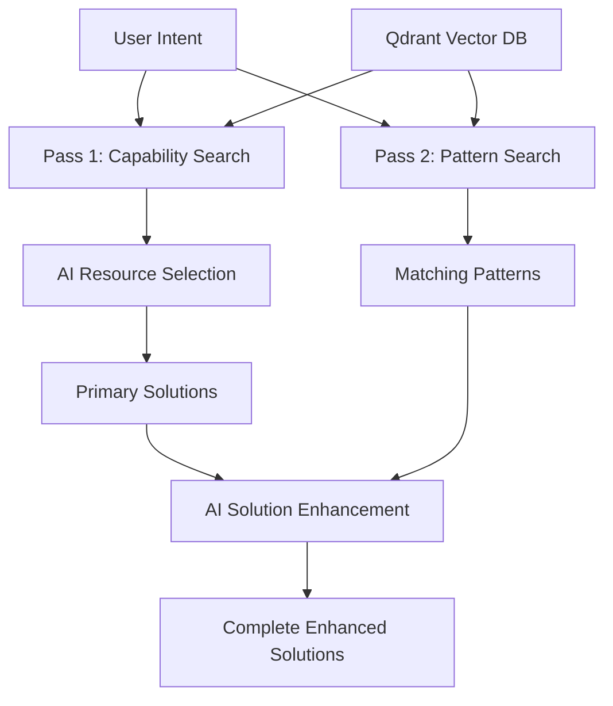

# PRD-53: Two-Pass AI Recommendation System with Pattern Enhancement

**Status**: Draft  
**Created**: 2025-08-10  
**GitHub Issue**: [#53](https://github.com/vfarcic/dot-ai/issues/53)  
**Dependencies**: Existing recommendation system, pattern management system, capability discovery system  
**Related PRDs**: [PRD #47 - Generic Cluster Data Management Tool](./47-generic-cluster-data-management-tool.md), [PRD #48 - Resource Capabilities Discovery](./48-resource-capabilities-discovery-integration.md), [PRD #49 - Resource Dependencies Discovery](./49-resource-dependencies-discovery-integration.md)

## Executive Summary

Current AI recommendation system fails to produce complete, deployable solutions because it cannot include pattern-suggested resources that don't appear in capability search results. This leads to incomplete solutions like Azure PostgreSQL deployments missing required ResourceGroup foundations, causing deployment failures.

This PRD proposes a two-pass AI recommendation system that separates primary resource discovery (Pass 1) from architectural pattern enhancement (Pass 2), ensuring complete solutions that include both capability-matched resources and organizationally-required architectural components.

## Problem Statement

### Current System Limitations

1. **Pattern Recognition Without Action**: System identifies relevant organizational patterns (high influence) but fails to include pattern-suggested resources in final solutions
2. **Capability Search Bottleneck**: AI can only select from the 50 resources returned by capability search, excluding pattern resources not semantically related to user intent
3. **Incomplete Deployments**: Solutions like "PostgreSQL database in Azure" return FlexibleServer + FlexibleServerFirewallRule but miss ResourceGroup, causing deployment failures
4. **Architecture vs Intent Mismatch**: Foundation resources (ResourceGroup) and architectural patterns (Service for Deployment) are organizationally required but not intent-related

### Real-World Impact

**Example 1**: Azure PostgreSQL Request
- User Intent: "PostgreSQL database in Azure"
- Current Result: [FlexibleServer, FlexibleServerDatabase, FlexibleServerFirewallRule]
- **Missing**: ResourceGroup (foundation requirement)
- **Deploy Status**: ❌ Fails - Azure resources require ResourceGroup container

**Example 2**: Web Application Request  
- User Intent: "Deploy web application"
- Current Result: [Deployment]
- **Missing**: Service (networking), Ingress (external access)
- **Deploy Status**: ✅ Deploys but ❌ Unreachable - no networking configured

## Success Criteria

### Primary Goals
- **Complete Solutions**: All recommendations include both primary resources and architectural requirements
- **Pattern Integration**: Organizational patterns successfully influence final resource selection
- **Deployment Success**: Recommended solutions deploy without manual intervention
- **Maintain Quality**: Primary resource selection quality remains high while adding completeness

### Success Metrics
- Azure database requests automatically include ResourceGroup
- Web application requests include Service + Ingress when patterns specify
- Deployment success rate improves for pattern-enhanced solutions  
- Zero reduction in primary resource selection quality

## Solution Architecture

### Two-Pass AI Recommendation Flow



### Pass 1: Primary Resource Discovery
- **Input**: User intent + capability-based resource search (50 results)
- **Process**: Existing AI resource selection and ranking logic
- **Output**: Structured solutions with primary resources, scoring, descriptions
- **Purpose**: High-quality primary resource selection based on capability matching

### Pass 2: Pattern-Based Enhancement  
- **Input**: User intent + Pass 1 solutions + pattern search results
- **Process**: New AI enhancement logic focused on architectural completeness
- **Output**: Enhanced solutions with pattern-suggested resources added
- **Purpose**: Ensure architectural completeness and organizational requirements

### Pattern Integration Strategy
- **Additive Only**: Pass 2 can only add resources, never remove or modify Pass 1 selections
- **Intelligent Deduplication**: AI handles overlap detection between passes
- **Context Preservation**: Pass 2 maintains solution coherence, updates scores and descriptions appropriately

## Technical Implementation

### Enhanced Recommendation Flow

```typescript
async findBestSolutions(intent: string, explainResource: Function): Promise<ResourceSolution[]> {
  // Pass 1: Existing capability-based resource selection
  const primarySolutions = await this.executePass1(intent, explainResource);
  
  // Pass 2: Pattern-based solution enhancement  
  const enhancedSolutions = await this.executePass2(intent, primarySolutions);
  
  return enhancedSolutions;
}

async executePass1(intent: string, explainResource: Function): Promise<ResourceSolution[]> {
  // Current implementation: capability search + AI selection + schema analysis
  const capabilities = await this.capabilityService.searchCapabilities(intent, { limit: 50 });
  const candidates = await this.selectResourceCandidates(intent, capabilities, []);
  const schemas = await this.fetchDetailedSchemas(candidates, explainResource);
  return await this.rankWithDetailedSchemas(intent, schemas, []);
}

async executePass2(intent: string, primarySolutions: ResourceSolution[]): Promise<ResourceSolution[]> {
  // New implementation: pattern search + AI enhancement
  const relevantPatterns = await this.searchRelevantPatterns(intent);
  
  if (relevantPatterns.length === 0) {
    return primarySolutions; // No enhancement needed
  }
  
  const enhancedSolutions = await this.enhanceWithPatterns(
    intent, 
    primarySolutions, 
    relevantPatterns
  );
  
  return enhancedSolutions;
}

async enhanceWithPatterns(
  intent: string, 
  solutions: ResourceSolution[], 
  patterns: OrganizationalPattern[]
): Promise<ResourceSolution[]> {
  const prompt = await this.loadPatternEnhancementPrompt(intent, solutions, patterns);
  const response = await this.claudeIntegration.sendMessage(prompt, 'pattern-enhancement');
  return this.parseEnhancedSolutions(response.content, solutions);
}
```

### New AI Prompt Template

```markdown
# Pattern-Based Solution Enhancement

## User Intent
{intent}

## Current Solutions (Pass 1)
{currentSolutions}

## Relevant Organizational Patterns
{patterns}

## Instructions

Enhance the current solutions by adding relevant resources suggested by organizational patterns.

**Enhancement Rules:**
- **Additive Only**: Only add resources, never remove or replace existing resources
- **Avoid Duplicates**: Don't add resources already included in current solutions
- **Pattern Completeness**: Include all relevant pattern resources unless technically incompatible
- **Maintain Coherence**: Update solution descriptions and scores to reflect enhancements
- **Preserve Structure**: Keep existing solution format and metadata

For each enhanced solution, provide:
- Updated resource list (original + pattern additions)
- Revised score reflecting architectural completeness
- Updated description explaining enhancements
- Enhanced reasons list including pattern rationale
```

## Implementation Milestones

### Milestone 1: Two-Pass Architecture Foundation
- **Deliverables**: 
  - Implement `executePass1()` and `executePass2()` structure
  - Create pattern enhancement prompt template
  - Add pattern search integration to Pass 2
- **Success Criteria**: Two-pass flow functional with basic pattern detection
- **Validation**: System can identify relevant patterns and pass them to AI

### Milestone 2: AI Pattern Enhancement Logic
- **Deliverables**:
  - Implement `enhanceWithPatterns()` AI integration
  - Create enhanced solution parsing logic
  - Add intelligent deduplication handling
- **Success Criteria**: AI successfully adds pattern resources to existing solutions
- **Validation**: ResourceGroup automatically added to Azure PostgreSQL solutions

### Milestone 3: Solution Quality Preservation  
- **Deliverables**:
  - Implement score recalculation for enhanced solutions
  - Add solution coherence validation
  - Ensure description and reasoning accuracy
- **Success Criteria**: Enhanced solutions maintain quality and consistency
- **Validation**: All solution metadata accurately reflects enhancements

### Milestone 4: Performance and Error Handling
- **Deliverables**:
  - Optimize two-pass performance impact
  - Add comprehensive error handling and fallbacks
  - Implement graceful degradation when patterns unavailable
- **Success Criteria**: System performance acceptable, robust error handling
- **Validation**: System handles pattern search failures gracefully

### Milestone 5: Integration Testing and Validation
- **Deliverables**:
  - Comprehensive testing with real user scenarios  
  - Validate pattern effectiveness across different resource types
  - Document new recommendation behavior and capabilities
- **Success Criteria**: Feature ready for production deployment
- **Validation**: All success criteria met, no regression in primary resource selection

## Risk Assessment

### Technical Risks
- **Performance Impact**: Two AI calls may significantly slow recommendations
- **Pattern Quality**: Poor pattern definitions could degrade solution quality
- **Context Limits**: Large solutions + patterns may exceed AI context windows
- **Complexity Bugs**: Two-pass logic introduces new failure modes

### Mitigation Strategies
- **Performance**: Implement parallel processing where possible, optimize prompts
- **Pattern Quality**: Implement pattern validation and quality scoring
- **Context Management**: Add smart truncation and summarization for large contexts
- **Testing**: Comprehensive unit and integration testing for two-pass scenarios

### Business Risks
- **User Experience**: Longer wait times for recommendations
- **Solution Accuracy**: Enhanced solutions might include unnecessary resources
- **Adoption**: Users might prefer current "simpler" recommendations

### Success Dependencies
- **Pattern System Maturity**: Requires well-defined organizational patterns
- **AI Model Performance**: Depends on Claude's ability to handle complex enhancement logic
- **Vector Search Quality**: Pattern search effectiveness impacts enhancement quality

## Dependencies and Assumptions

### Technical Dependencies
- Existing recommendation system (Pass 1 functionality)
- Pattern management system with Vector DB storage
- Claude AI integration for pattern enhancement
- Capability discovery and search infrastructure

### Assumptions
- Organizational patterns are properly defined and stored
- Pattern search will find relevant patterns for user intents
- AI can intelligently merge pattern resources without guidance complexity
- Two-pass performance impact is acceptable for recommendation quality improvement

## Related Work

### Builds Upon
- **PRD #47**: Generic cluster data management provides pattern storage infrastructure
- **PRD #48**: Resource capabilities provide Pass 1 primary resource discovery
- Current recommendation system architecture and AI integration

### Enables Future Work
- Advanced pattern learning from successful deployments
- Cross-solution pattern optimization and conflict resolution
- Dynamic pattern effectiveness measurement and improvement
- Integration with deployment orchestration for validation feedback

## Conclusion

Two-pass AI recommendation system addresses the core limitation of current capability-only resource selection by ensuring organizational patterns successfully influence final solutions. This architectural approach maintains high-quality primary resource selection while adding essential completeness for deployable solutions.

The solution is scoped to be additive-only and backwards-compatible, ensuring no regression in current functionality while solving the critical gap between pattern recognition and pattern application in AI recommendations.